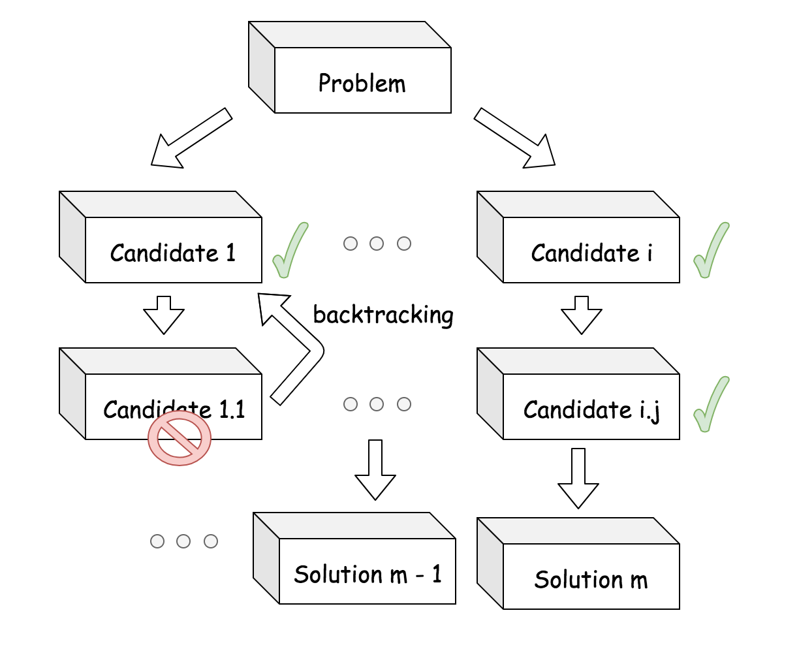
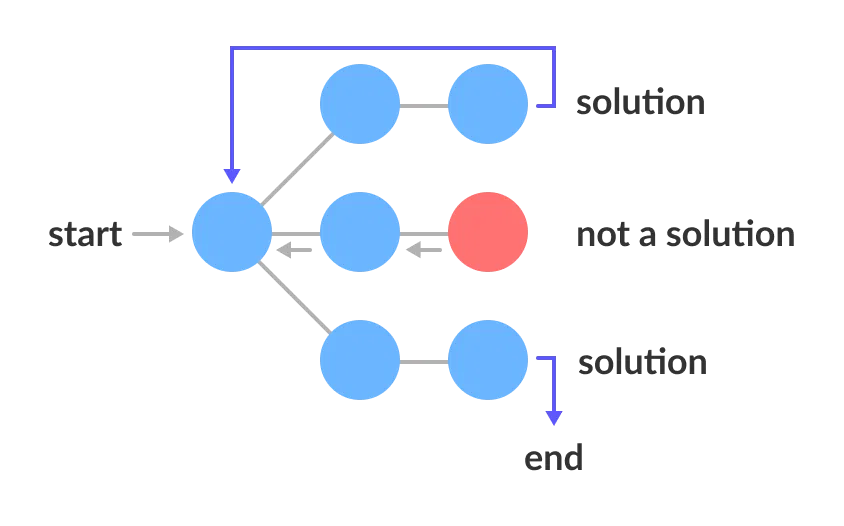
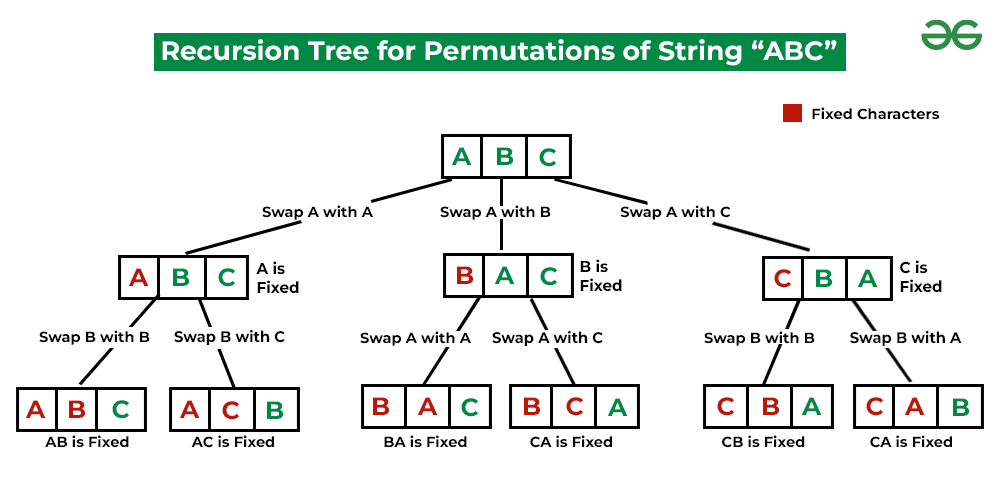
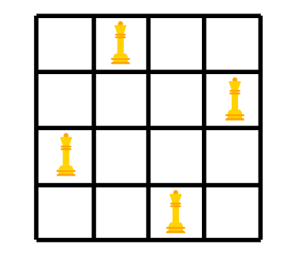
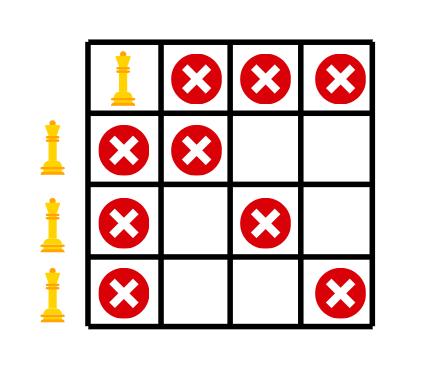

Backtracking is a class of algorithms for finding solutions to some computational problems, notably constraint satisfaction problems, that **incrementally builds candidates to the solutions, and abandons a candidate ("backtracks") as soon as it determines that the candidate cannot possibly be completed to a valid solution**. **Backtracking is a systematic way to run through all the possible configurations of a search space**. These configurations may represent all possible arrangements of objects (permutations) or all possible ways of building a collection of them (subsets).



**Backtracking is a technique for solving constraint satisfaction problems. In these problems we want to generate each possible configuration that satisfies our constraints exactly once**. This is a typical pattern in combinatorial problems. Avoiding repetitions and missed configurations means that we must define a systematic generation order.

### Functioning

**The backtracking algorithm enumerates a set of partial candidates that, in principle, could be completed in various ways to give all the possible solutions to the given problem. These partial solutions can be represented as a nodes of a tree, called the space tree**.



**This tree is constructed in a recursive DFS manner**. Starting from the root, we try to extend a partial solution by adding to it an additional element. This is called the extension step. After the extension, we must consider whether to continue that path or not by checking two possibilities:

1.  It the new node constitutes a complete solution, we need to somehow keep track of it (for example store it somewhere or print it).
2.  **If the new node cannot be completed to a valid solution due to the violation of the problem constraints, the branch is abandoned**. This technique is called **pruning**.

**In both these cases, the algorithms needs to backtrack, meaning it goes back one step and explores another path from the previous point, which could lead to more solutions. The pruning step is the key to reducing the search time compared to a naive exhaustive search**.

From the way the tree is constructed, we can observe that each partial candidate is the parent of the candidates that differ from it by a single extension step. In other terms, there is an edge from $x$ to $y$ if node $y$ was created by extending $x$. At each node, the current state of the search is completely represented by the path from the root to the current node.

### Implementation

**Backtracking ensures correctness by enumerating all possibilities, and ensures efficiency by never visiting a state more than once**.

Most backtracking solutions can be formulated by adjusting the following pseudocode template:

```Python
def backtrack(candidate):
    if is_valid_solution(candidate):
        output(candidate)
        return
    
    # iterate all possible candidates.
    for next_candidate in list_of_candidates:
        if is_valid(next_candidate):
            # try this partial candidate solution
            place(next_candidate)
            # given the candidate, explore further.
            backtrack(next_candidate)
            # backtrack
            remove(next_candidate)
```

Overall, the enumeration of candidates is done in two levels:

1.  At the first level, the function is implemented as recursion. At each occurrence of recursion, the function is one step further to the final solution.
2.  As the second level, within the recursion, we have an iteration that allows us to explore all the candidates that are of the same progress to the final solution.

**This is extremely similar to a pre-order DFS traversal of an N-ary tree**. In fact, the loop at each level allows us to consider each node's child (since in general the problem leads to an N-ary state tree). The recursion instead allows us to visit the next level of the tree.

To fill the template, we must define some functions for the problem at hand. First of all, we need a boolean function that tests if a state corresponds to a valid solution for the problem. Second, we need another boolean function that can quickly test whether a state can possibly be completed to a valid solution. **The efficiency of the backtracking algorithm depends mostly on this procedure returning true for candidates that are as close to the root as possible. If `is_valid` always returns `true`, the algorithm will still find all solutions, but it will be equivalent to a brute-force search**.

For the problems that only require finding one solution, we can slightly modify the template to include a boolean flag. Since these problem do not require enumerating all possible solutions, we can set this flag as soon as the first solution is found. As a last statement inside the for loop, we can return if the flag is true.

Lastly, notice that, in theory, BFS could also be used to enumerate all solutions. However, in BFS a queue must store all nodes at the current level. For most problems, the width of the tree grows exponentially with its height, so that DFS uses much less space.

### Complexity

Backtracking provides a way to optimize exhaustive search of a solutions space. Because it fundamentally behaves as a brute-force approach, backtracking algorithms generally perform quite poorly. While it can be hard to define an exact upper bound for a backtracking algorithms, most of them end up having exponential ($O(K^N)$) or factorial ($O(N!)$) complexity.

### Examples

#### Permutations

A first simple example of backtracking is that of generating all possible permutations of a string $S$. Starting from the first character, it recursively swaps each character with the current index. After each swap, it recursively generates all permutations of the remaining substring. After generating permutations for a particular arrangement, it backtracks by undoing the swap to explore other possible permutations.



Notice that in this algorithm all permutations are correct. This means that there is never any pruning occurring. Hence, here backtracking is used as a way to perform an exhaustive search of the solution space in a structured manner.

```C++
void permutationsHelper(std::string& s, std::vector<std::string>& res, std::size_t idx) {
    if (idx == s.size()) {
        res.push_back(s);
        return;
    }
    for (std::size_t i = idx; i < s.size(); ++i) {
        std::swap(s[idx], s[i]);
        permutationsHelper(s, res, idx + 1);
        std::swap(s[idx], s[i]);
    }
}

std::vector<std::string> permutations(const std::string& s) {
    std::vector<std::string> res;
    std::string str = s;
    permutationsHelper(str, res, 0);
    return res;
}
```

The time complexity is $O(n * n!)$. In fact, there are $n!$ possible permutations of the given string and it takes a time of $n$ to fill each string in the result vector.

#### N-Queens

A classic example, although more complex, is that of the N-Queens problem. This consists in placing N chess queens on an N×N chessboard so that no two queens attack each other.



Two queens can attack each other when they are in the same row, same columns, same diagonal, or same anti-diagonal. For a given board size, there might be 0 or multiple solutions. Clearly, each queen must be placed in a different row. The problem then becomes to find the right column to place each queen.

The idea is to start placing queens row by row. For each row, we try placing a queen in each column. Before placing a queen, we check if the current column and the two diagonals (left and right) are free from other queens. If the move under inspections is not valid, we try the next column. If we realize the current arrangement does not lead to a solution, we backtrack by removing the last placed queen and trying the next possible position. If we find a valid solution, we store and continue.



The code follows the standard backtracking template. If a move is not valid, we prune the current tree and check the next configuration. When we reach a solution, we store it and backtrack to find other possible ones. The most complex part of the program is supplying a procedure to check if a move is valid, which requires some indices manipulation over the board.

```C++
void backtrack(int n, vector<string>& board, int row, vector<vector<string>>& res) {
    if (row == n) {
        res.push_back(board);  // Store the solution
        return;
    }
    for (int col = 0; col < n; ++col) {
    	// Prune invalid moves
        if (isValidMove(board, row, col, n)) {
            board[row][col] = 'Q';  // Place a queen
            solveNQueensUtil(n, board, row + 1, res);
            board[row][col] = '.';  // Remove the queen (backtrack)
        }
    }
}

vector<vector<string>> solveNQueens(int n) {
    vector<string> board(n, string(n, '.'));
    vector<vector<string>> res;
    backtrack(n, board, 0, res);
    return res;
}
```