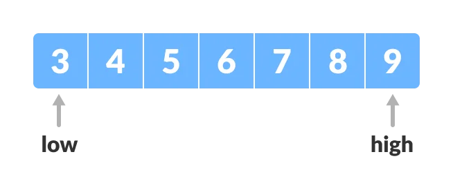
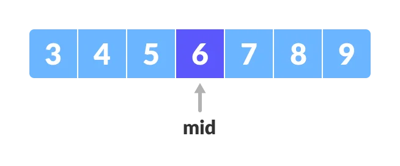
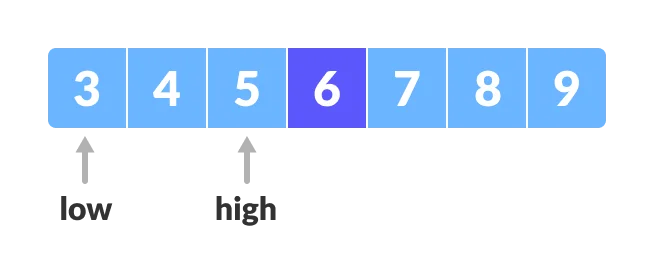
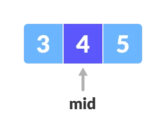
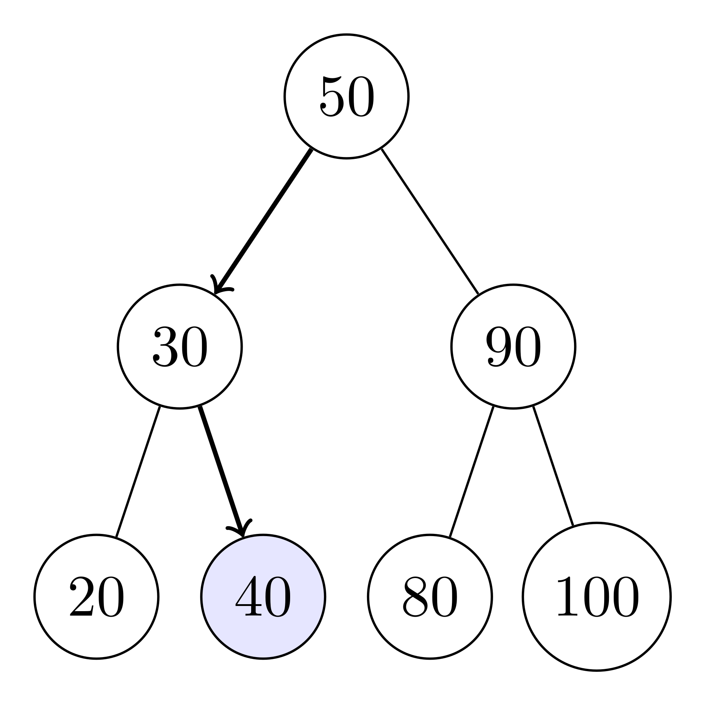

Binary search is a search algorithm that finds the position of a target value **within a sorted array**. It works by comparing the target value to the middle element of the array. If they are not equal, the half in which the target cannot lie is eliminated and the search continues on the remaining half, again taking the middle element to compare to the target value, and repeating this until the target value is found. If the search ends with the remaining half being empty, the target is not in the array.

The algorithm can be broken down in 4 steps:

1.  Check the value in the center of the array.
2.  If the target value is lower, search the left half of the array. If the target value is higher, search the right half.
3.  Continue step 1 and 2 for the new reduced part of the array until the target value is found or until the search area is empty.
4.  If the value is found, return the target value index. If the target value is not found, return -1.

We have an initial array.  
  
To find the middle element we perform `(low+high)/2`.  
  
If `target > mid`, compare `target` with the middle element of the elements on the right side of mid. This is done by setting low to `low = mid + 1`. Else, compare `target` with the middle element of the elements on the left side of mid. This is done by setting high to `high = mid - 1`.  
  
We then repeat until `low` meets `high`.  


### Iterative algorithm

```C++
template <typename T>
int bsearch(const T& container, const typename T::value_type& val) {
    int low = 0, high = container.size() - 1;
    while (low <= high) {
        int mid = low + (high - low) / 2;
        if (container[mid] > val) high = mid - 1;
        else if (container[mid] < val) low = mid + 1;
        else return mid;
    }
    return -1;
}
```

### C++ STL

The C++ STL has a `binary_search` function. However, this name is not very precise, as the function checks if the item is present in the sequence and returns a `bool`. The closest thing to a real binary search in the STL is the function `lower_bound`. This returns an iterator pointing to the first element in the range which does not compare less than val. This means that if the searched item is not in the sequence, the algorithm can return an iterator different from `end()`. We can however add a check after calling `lower_bound` to create our own binary search:

```C++
template <typename T>
T bSearchLibIt (T first, T last, const typename T::value_type& val) {
    T it = lower_bound(first, last, val);
    return (it != last && !(val < *it)) ? it : last;
}
```

### Performance

In terms of the number of comparisons, the performance of binary search can be analyzed by viewing the run of the procedure on a binary tree. The root node of the tree is the middle element of the array. The middle element of the lower half is the left child node of the root, and the middle element of the upper half is the right child node of the root. The rest of the tree is built in a similar fashion. Starting from the root node, the left or right subtrees are traversed depending on whether the target value is less or more than the node under consideration.  
  
In the worst case, the element is found in the deepest level of the tree, which contains ${\textstyle \lfloor \log _{2}(n)+1\rfloor }$ levels. The worst case is also reached when the element is not in the sequence.  
For the average case, we can consider the precedure to be still logarithmic.  
In the best case, the elements is found at the first comparison.

The algorithm requires no extra use of memory.

|     | Worst case | Average case | Best case | Memory |
| --- | --- | --- | --- | --- |
| Complexity | $O(log _{2}(n))$ | $O(log _{2}(n))$ | $O(1)$ | $O(1)$ |

In real implementations, it's interesting to notice that **binary search has much poorer cache locality than linear algorithms**. On a sorted array, binary search can jump to distant memory locations if the array is large, unlike algorithms (such as linear search) which access elements in sequence. This results in a much grater number of cache misses. This adds slightly to the running time of binary search for large arrays on most systems.