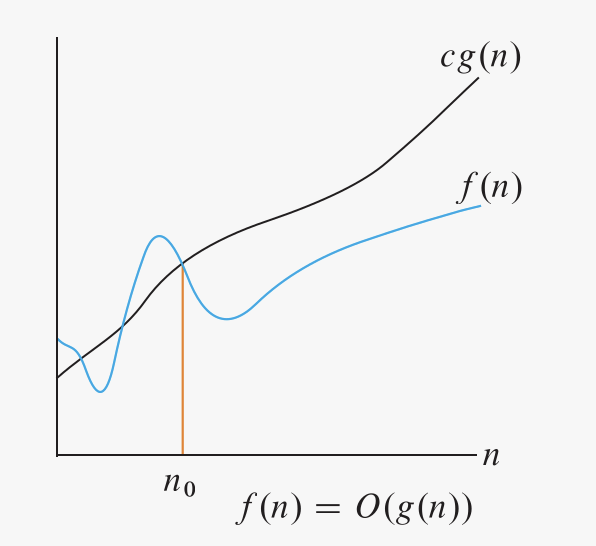
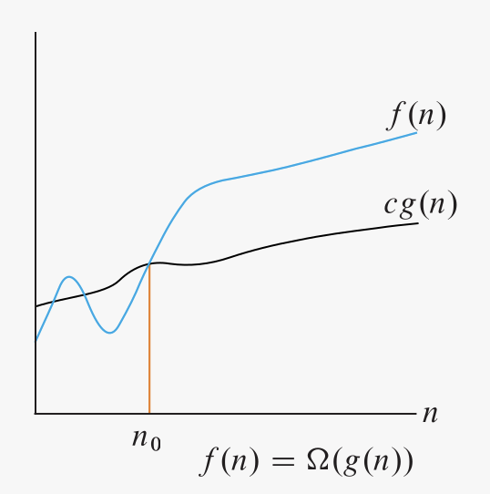
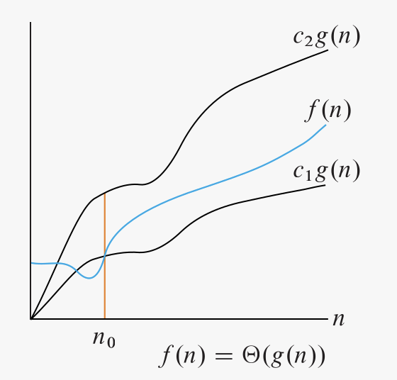

The time complexity is the computational complexity that describes the amount of computer time it takes to run an algorithm. The time complexity is generally expressed as a function of the size of the input. Since this function is generally difficult to compute exactly, and the running time for small inputs is usually not consequential, one commonly focuses on the behavior of the complexity when the input size increases—that is, the asymptotic behavior of the complexity. Usually, an algorithm that is asymptotically more efficient is the best choice for all but bery small inputs.

### Asymptotic notations

These notations describe the rate of growth of the running time of an algorithm in relation to the size of its input.

#### O-notation

O-notation characterizes an upper bound on the asymptotic behavior of a function. In other words, **it says that a function grows no faster than a certain rate, based on the highest-order term**. Consider, for example, the function $7n^3 + 100n^2 - 20n + 6$. Because this function grows no faster than $n^3$, we can write that it is $O(n^3 )$. Notice that technically we can also say this function is $O(n^4 )$, $O(n^5 )$, and so on. This is correct, since the original function grows more slowly than any of these options. Since we use O-notation to give an upper bound on a function, the tighter bound is of course the most meaningful one.

Formally, for a given function $g(n)$, we denote by $O(g(n)$ the set of functions:

${\displaystyle O(g(n))=\{f(n):{\text{there exist positive constants}}~c~{\text{and}}~n_{0}~{\text{such that}}~0\leq f(n)\leq cg(n){\text{ for all }}n\geq n_{0}\}.}$

A function $f(n)$ belongs to the set $O(g(n))$ if there exists a positive constant $c$ such that $f(n) <= cg(n)$ for sufficiently large $n$.

Notice that the use of the $=$ sign is technicallty a notation abuse, since really, when writing $f(n) = O(g(n))$, we are indicating that $f(n)$ belongs to the set $O(g(n))$.

#### Ω-notation

Ω-notation characterizes a lower bound on the asymptotic behavior of a function. In other words, **it says that a function grows at least as fast as a certain rate, based on the highest-order term**. Consider, for example, the function $7n^3 + 100n^2 - 20n + 6$. Because this function grows at least as fast as $n^3$ , we can write that it is $Ω(n^3)$. By the same logic, this function is also $Ω(n^2)$, $Ω(n)$.

Formally, we denote by $Ω(g(n))$ the set of functions:

${\displaystyle Ω(g(n))=\{f(n):{\text{there exist positive constants}}~c~{\text{and}}~n_{0}~{\text{such that}}~0\leq cg(n)\leq f(n){\text{ for all }}n\geq n_{0}\}.}$

For all values of $n$ at or to the right of $n_0$, the value of $f(n)$ is on or above $cg(n)$.

####  Θ-notation

Θ-notation characterizes a tight bound on the asymptotic behavior of a function. **It says that a function grows precisely at a certain rate, based on the highest-order term**. Θ-notation characterizes the rate of growth of the function to within a constant factor from above and to within a constant factor from below. **If you can show that a function is both $O(f(n)$ and $Ω(f(n))$ for some function $f(n)$, then you have shown that the function is $Θ(f(n)$**. For example, since the function is both $O(n^3)$ and $Ω(n^3)$, it is also $Θ(n^3)$.

Formally, we denote by $Θ(g(n))$ the set of functions:

${\displaystyle Θ(g(n))=\{f(n):{\text{there exist positive constants}}~c~{\text{and}}~n_{0}~{\text{such that}}~0\leq c_{1}g(n)\leq f(n)\leq  c_{2}g(n){\text{ for all }}n\geq n_{0}\}.}$

For all values of $n$ at or to the right of $n_0$, the value of $f(n)$ lies at or above of $c_1g(n)$ and at or below $c_2g(n)$. In other words, for all $n >= n_0$, the function $f(n)$ is equal to $g(n)$ to within constant factors.

Theorem:
**For any two functions $f(n)$ and $g(n)$, we have $f(n) = Θ(g(n))$ if and only if $f(n) = O(g(n))$ and $f(n) = Ω(g(n))$**.

### Asymptotic notations and running times

When expressing the complexity of an algorithm, we should always use the most precise bound by picking the right notation symbol. The idea is to **use the simplest and most precise bound possible**.

Pay attention to which case of an algorithm is a certain complexity referring to. For example, for insertion sort, we can say it's $O(n^2)$, as its running time grows no faster than that. Instead, we cannot say insertion sort is $Θ(n^2)$ in all cases, since there are cases in which it can run faster. We can however say that insertion sort worst case is $Θ(n^2)$ and its best case is $Θ(n)$. Hence, always pay attention to what you are referring: the algorithm in general, its best case, or its worst case.

Also, keep in mind that asymptotic notation does not include constant factors. This mean that **an algorithm whose running time has a higher order of growth might take less time for small inputs than an algorithm whose running time has a lower order of growth**.