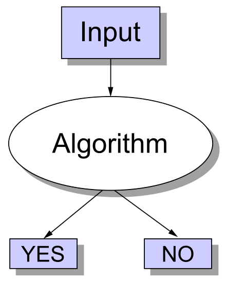

The time complexity is the computational complexity that describes the amount of computer time it takes to run an algorithm. The time complexity is generally expressed as a function of the size of the input. Since this function is generally difficult to compute exactly, and the running time for small inputs is usually not consequential, one commonly focuses on the behavior of the complexity when the input size increases—that is, the asymptotic behavior of the complexity. Usually, an algorithm that is asymptotically more efficient is the best choice for all but very small inputs.

## Asymptotic notations

These notations describe the rate of growth of the running time of an algorithm in relation to the size of its input.

### O-notation

O-notation characterizes an upper bound on the asymptotic behavior of a function. In other words, **it says that a function grows no faster than a certain rate, based on the highest-order term**. Consider, for example, the function $7n^3 + 100n^2 - 20n + 6$. Because this function grows no faster than $n^3$, we can write that it is $O(n^3 )$. Notice that technically we can also say this function is $O(n^4 )$, $O(n^5 )$, and so on. This is correct, since the original function grows more slowly than any of these options. Since we use O-notation to give an upper bound on a function, the tighter bound is of course the most meaningful one.

Formally, for a given function $g(n)$, we denote by $O(g(n))$ the set of functions:

${\displaystyle O(g(n))=\{f(n):{\text{there exist positive constants}}~c~{\text{and}}~n_{0}~{\text{such that}}~0\leq f(n)\leq cg(n){\text{ for all }}n\geq n_{0}\}.}$

A function $f(n)$ belongs to the set $O(g(n))$ if there exists a positive constant $c$ such that $f(n) ≤ cg(n)$ for sufficiently large $n$.

Notice that the use of the $=$ sign is technically a notation abuse, since really, when writing $f(n) = O(g(n))$, we are indicating that $f(n)$ belongs to the set $O(g(n))$.

### Ω-notation

Ω-notation characterizes a lower bound on the asymptotic behavior of a function. In other words, **it says that a function grows at least as fast as a certain rate, based on the highest-order term**. Consider, for example, the function $7n^3 + 100n^2 - 20n + 6$. Because this function grows at least as fast as $n^3$, we can write that it is $Ω(n^3)$. By the same logic, this function is also $Ω(n^2)$, $Ω(n)$.

Formally, we denote by $Ω(g(n))$ the set of functions:

${\displaystyle Ω(g(n))=\{f(n):{\text{there exist positive constants}}~c~{\text{and}}~n_{0}~{\text{such that}}~0\leq cg(n)\leq f(n){\text{ for all }}n\geq n_{0}\}.}$

For all values of $n$ at or to the right of $n_0$, the value of $f(n)$ is on or above $cg(n)$.

### Θ-notation

Θ-notation characterizes a tight bound on the asymptotic behavior of a function. **It says that a function grows precisely at a certain rate, based on the highest-order term**. Θ-notation characterizes the rate of growth of the function to within a constant factor from above and to within a constant factor from below. **If you can show that a function is both $O(f(n))$ and $Ω(f(n))$ for some function $f(n)$, then you have shown that the function is $Θ(f(n))$**. For example, since the function $7n^3 + 100n^2 - 20n + 6$ is both $O(n^3)$ and $Ω(n^3)$, it is also $Θ(n^3)$.

Formally, we denote by $Θ(g(n))$ the set of functions:

${\displaystyle Θ(g(n))=\{f(n):{\text{there exist positive constants}}~c~{\text{and}}~n_{0}~{\text{such that}}~0\leq c_{1}g(n)\leq f(n)\leq c_{2}g(n){\text{ for all }}n\geq n_{0}\}.}$

For all values of $n$ at or to the right of $n_0$, the value of $f(n)$ lies at or above of $c_1g(n)$ and at or below $c_2g(n)$. In other words, for all $n ≥ n_0$, the function $f(n)$ is equal to $g(n)$ to within constant factors.

Theorem:  
**For any two functions $f(n)$ and $g(n)$, we have $f(n) = Θ(g(n))$ if and only if $f(n) = O(g(n))$ and $f(n) = Ω(g(n))$**.

## Asymptotic notations and running times

When expressing the complexity of an algorithm, we should always use the most precise bound by picking the right notation symbol. The idea is to **use the simplest and most precise bound possible**.

Pay attention to which case of an algorithm is a certain complexity referring to. For example, for insertion sort, we can say it's $O(n^2)$, as its running time grows no faster than that. Instead, we cannot say insertion sort is $Θ(n^2)$ in all cases, since there are cases in which it can run faster. We can however say that insertion sort worst case is $Θ(n^2)$ and its best case is $Θ(n)$. Hence, always pay attention to what you are referring: the algorithm in general, its best case, or its worst case.

Also, keep in mind that asymptotic notation does not include constant factors. This means that **an algorithm whose running time has a higher order of growth might take less time for small inputs than an algorithm whose running time has a lower order of growth**.

## Complexity classes

**A complexity class is a set of problems of related complexity**. A complexity class is defined in terms of a type of computational problem, a model of computation, and a bounded resource like time or memory. In particular, most complexity classes consist of decision problems that are solvable with a Turing machine, and are differentiated by their time or space requirements.

The study of the relationships between complexity classes is a major area of research in theoretical computer science. \*\*Some of the most important complexity classes, such as $P$ and $NP$, are defined based on the **time** required by a **Turing machine** to solve a given **decision problem**. When talking about $P$ and $NP$, keep in mind these three implicit factors.

### Decision problems

**The classic complexity classes $P$ and $NP$ apply to decision problems**. These are problems for which the answer is either "yes" or "no". For example, "is the natural number $n$ prime?".

Many interesting problems in computer science are optimization problems, in which the goal is finding the feasible solution with the optimal value. These problems are not expressed as yes–no type of questions. However, **there is usually a way to cast a given optimization problem as a related decision problem** by imposing a bound on the value to be optimized.

For example, in a problem that we call $SHORTEST-PATH$, the input is an undirected graph $G$ and vertices $u$ and $v$ , and the goal is to find a path from $u$ to $v$ that uses the fewest edges. A decision problem related to $SHORTEST-PATH$ is $PATH$: given an undirected graph $G$ , vertices $u$ and $v$, and an integer $k$, does a path exist from $u$ to $v$ consisting of at most $k$ edges?

There is relationship between the time complexity of an optimization problem and that of its related decision problem. In particular, **the decision problem is no harder than the optimization one**. Hence, if an optimization problem is easy, its related decision problem is easy as well. Stated differently, **if you can provide evidence that a decision problem is hard, you also provide evidence that its related optimization problem is hard**. Thus, even though it restricts attention to decision problems, the theory of NP-completeness often has implications for optimization problems as well.

Formally, we can define an abstract decision problem as a function that maps the set of problem instances $I$ to the solution set $\{0, 1\}$. An instance of a problem is simply the problem with its input parameters specified.

### Complexity class $P$

**The class $P$ consists of the set of problems that are solvable in polynomial time**. More specifically, they are problems that can be solved in **$O(n^k)$** time for some constant $k$ , where $n$ is the size of the input to the problem.

Formally:  
$P$ = {$L$: $L$ is accepted by a polynomial-time algorithm}

Given a decision problem $Q$, we can view it as the language $L$ such that:  
$L$ = {$x$ ∈ $Σ^*$ : $Q(x)$ = 1}

We say that an algorithm $A$ accepts a string $x$ if, given input $x$, the algorithm’s output $A(x)$ is 1. The language accepted by an algorithm $A$ is the set of strings $L$ = {$x$ ∈ $Σ^*$ : $A(x)$ = 1}, that is, the set of strings that the algorithm accepts. A language $L$ is accepted in polynomial time by an algorithm $A$ if it is accepted by $A$ and if in addition there exists a constant $k$ such that for any length-n string $x$ ∈ $L$, algorithm $A$ accepts $x$ in $O(n^k)$ time.

### Complexity class $NP$

**The class NP consists of those problems that are verifiable in polynomial time**. Alternatively, NP can be defined as the set of problems that can be solved in polynomial time by a nondeterministic Turing machine. The two definitions are equivalent, but the first is slightly simpler, so we will stick to that.

What do we mean by a problem being verifiable? If you were somehow given a certificate of a solution, then you could verify that the certificate is correct in time polynomial in the size of the input to the problem. In other terms, given an instance of a problem and a guess of its solution, we can determine if the guess is a correct solution in polynomial time.

Formally, we define a verification algorithm as being a two-argument algorithm $A$, where one argument is an ordinary input string $x$ and the other is a binary string $y$ called a certificate. A two-argument algorithm $A$ verifies an input string $x$ if there exists a certificate $y$ such that $A(x, y) = 1$. The language verified by a verification algorithm $A$ is:  
$L$ = {$x$ ∈ $Σ^*$ : there exists $y$ ∈ $Σ^*$ such that $A(x, y)$ = 1}

Then, we can state that a language $L$ belongs to $NP$ if and only if there exist a verification algorithm $A$ that verifies $L$ in polynomial time.

### Relationship between $P$ and $NP$

Any problem in $P$ also belongs to $NP$, because if a problem is solvable in polynomial time, then a solution is also verifiable in polynomial time by simply solving the problem. So we can say **$P ⊆ NP$**. The famous open question is whether $P$ is a proper subset of $NP$, which equates to asking if $P = NP$. In turn, this questions wether nondeterminism provides any additional computational power over determinism with regards to the ability to quickly find a solution to a problem. A definitive answer is unknown, but most researchers believe that $P$ and $NP$ are not the same class.

Perhaps the most compelling reason why theoretical computer scientists believe that $P ≠ NP$ comes from the existence of the class of NP-complete problems. This class has the intriguing property that **if any NP-complete problem can be solved in polynomial time, then every problem in NP has a polynomial-time solution**, that is, $P = NP$. Despite decades of study, though, no polynomial-time algorithm has ever been discovered for any NP-complete problem.

Because of this, we consider problems in $P$ as tractable, while if you can establish a problem as NP-complete, you provide good evidence for its intractability.

### Reduction

Informally, think of a problem $Q$ as being reducible to another problem $Q'$ if any instance of $Q$ can be recast as an instance of $Q'$ , and the solution to the instance of $Q'$ provides a solution to the instance of $Q$. We call such casting procedure a reduction algorithm. In symbols, if a language $L_1$ is polynomial-time reducible to $L_2$, we write $L1 ≤_P L2$.

We can use this notion to show that one problem is no harder or no easier than another. In fact, almost every NP-completeness proof takes advantage of this idea. Generally, we use the following procedure:

1.  Given an instance $I$ of problem $A$, use a polynomial-time reduction algorithm to transform it to an instance $I'$ of problem $B$.
2.  Run the polynomial-time decision algorithm for $B$ on the instance $I'$.
3.  Use the answer for $I'$ as the answer for $I$.

Suppose that you have a decision problem $A$ for which you already know that no polynomial-time algorithm can exist. Suppose further that you have a polynomial-time reduction transforming instances of $A$ to instances of $B$. Now you can use a simple proof by contradiction to show that no polynomial-time algorithm can exist for $B$.

The reduction technique relies on having a problem already known to be NP-complete which we can reduce our problem to. The typical choice is that of the **satisfiability problem (SAT), which is the first problem that was proven to be NP-complete**. SAT is the problem of determining if there exists an interpretation that satisfies a given Boolean formula.

### NP-completeness

The **NP-complete languages are**, in a sense, **the hardest languages in NP**. Informally, **a problem belongs to the class $NPC$ and we call it NP-complete if it belongs to $NP$ and is as hard as any problem in $NP$**.

Formally, a language $L$ is NP-complete if:

1.  $L ∈ NP$, and
2.  $L' ≤_P L$ for every $L' ∈ NP$.

**If a language L satisfies property 2, but not necessarily property 1, we say that $L$  
is NP-hard**.

A consequence of this definition is that if we had a polynomial time algorithm to accept $L$, we could accept all NP languages in polynomial time. Hence, **if any NP-complete probelm is solvable in polynomial time, then $P=NP$**.