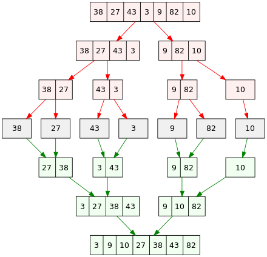
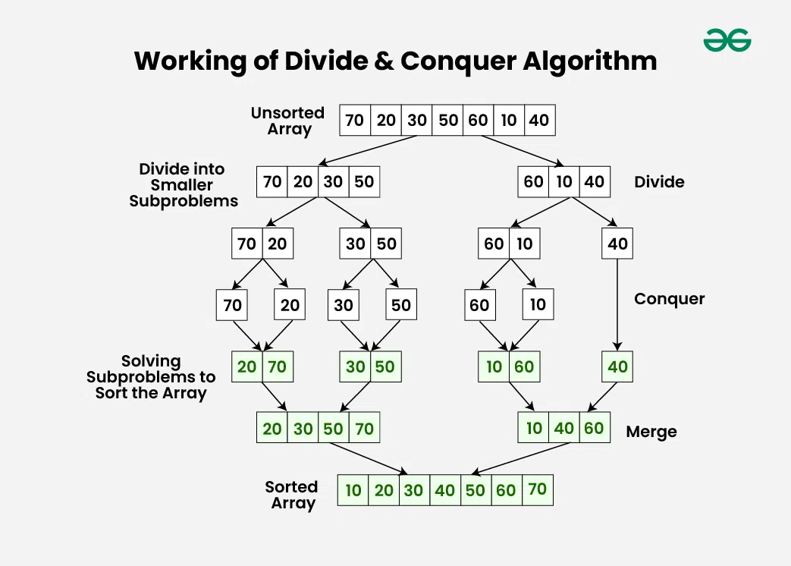

In computer science, divide and conquer is an algorithm design paradigm. **A divide-and-conquer algorithm recursively breaks down a problem into two or more sub-problems of the same or related type, until these become simple enough to be solved directly. The solutions to the sub-problems are then combined to give a solution to the original problem**.

The basic idea is to decompose a given problem into two or more similar, but simpler, subproblems, to solve them in turn, and to compose their solutions to solve the given problem. Problems of sufficient simplicity are solved directly (these simple problems constitute the base case), with no need to frurther recurse.

For example, in the Merge Sort algorithm, the “Divide and Conquer” strategy is used to sort a list of elements by splitting it in $n/2$ chunks.

**Notice that the name "divide and conquer" is sometimes applied to algorithms that reduce each problem to only one sub-problem, such as binary search. However, these type of algorithms can be implemented more efficiently than general divide-and-conquer algorithms by using tail recursion or simply using loops. Therefore, some authors consider that the name "divide and conquer" should be used only when each problem may generate two or more subproblems.**

### Steps

Divide and Conquer Algorithm can be divided into **three stages: Divide, Conquer and Merge**.
1. **Divide**:
- Break down the original problem into smaller subproblems.
- Each subproblem should represent a part of the overall problem.
- The goal is to divide the problem until no further division is possible.

2. **Conquer**:
- Solve each of the smaller subproblems individually.
- If a subproblem is small enough (often referred to as the “base case”), we solve it directly without further recursion.
- The goal is to find solutions for these subproblems independently.

3. **Merge**:
- Combine the sub-problems to get the final solution of the whole problem.
- Once the smaller subproblems are solved, we recursively combine their solutions to get the solution of larger problem.
- The goal is to formulate a solution for the original problem by merging the results from the subproblems.

The original problem is typically broken down into smaller ones by means of recursion. **Each subproblem should be independent of the others, meaning that solving one subproblem does not depend on the solution of another**. 

### Advantages

Divide and conquer is the basis of several efficient algorithms, such as quicksort, mergesort, Karatsuba and Strassen multiplication, etc. Due to the nature of each subproblem being independent form others, D&C algorithms naturally adapt to parallel execution. Moreover, these algorithms tend to make optimal use of cache memory. The reason is that once a sub-problem is small enough, it and all its sub-problems can, in principle, be solved within the cache, without accessing the slower main memory. This optimal cache behavior appears regardless of the size of the cache. 

### Disadvantages

In recursive implementations of D&C algorithms, one must make sure that there is sufficient memory allocated for the recursion stack, otherwise, the execution may fail because of stack overflow. D&C algorithms that are time-efficient often have relatively small recursion depth.

In any recursive algorithm, there is considerable freedom in the choice of the base cases, the small subproblems that are solved directly in order to terminate the recursion. 
Choosing the smallest or simplest possible base cases is more elegant and usually leads to simpler programs, because there are fewer cases to consider and they are easier to solve. 
On the other hand, **efficiency often improves if the recursion is stopped at relatively large base cases, and these are solved non-recursively, resulting in a hybrid algorithm**. This strategy avoids the overhead of recursive calls that do little or no work and may also allow the use of specialized non-recursive algorithms that, for those base cases, are more efficient than explicit recursion. Thus, for example, many library implementations of quicksort will switch to a simple loop-based insertion sort (or similar) algorithm once the number of items to be sorted is sufficiently small. Note that, if the empty list were the only base case, sorting a list with n entries would entail maximally n quicksort calls that would do nothing but return immediately. The technique of stopping the recursion when the problem size becomes small enough that the overhead of further dividing the problem is not worth the computational savings, is called coarsening.

For some problems, the branched recursion may end up evaluating the same sub-problem many times over. In such cases it may be worth identifying and saving the solutions to these overlapping subproblems, a technique which is commonly known as memoization, which is part of dynamic programming.

### Complexity

Because divide and conquer uses recursion, the running time can often be described using a recurrence equation. 