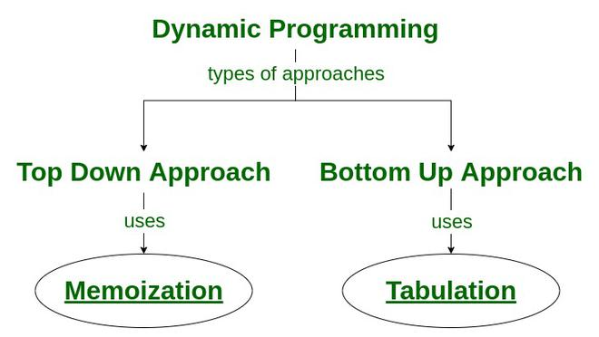

Dynamic programming is both a mathematical optimization method and an algorithmic paradigm. Dynamic programming, like the divide-and-conquer method, solves problems by combining the solutions to subproblems. Divide-and-conquer algorithms partition the problem into disjoint subproblems, solve the subproblems recursively, and then combine their solutions to solve the original problem. In contrast, **dynamic programming applies when the subproblems overlap - that is, when subproblems share subproblems**. In this context, a divide-and-conquer algorithm does more work than necessary, repeatedly solving the common subproblems. **A dynamic-programming algorithm solves each subproblem just once and then saves its answer in a table, thereby avoiding the work of recomputing the answer every time it solves each subproblem**.

Dynamic programming typically applies to optimization problems, where we seek to find a solution that maximizes or minimizes an objective function. Greedy algorithms that make the best local decision at each step are typically efficient, but usually do not guarantee global optimality. Exhaustive search algorithms that try all possibilities and select the best always produce the optimum result, but usually at a prohibitive cost in terms of time complexity. Dynamic programming combines the best of both worlds. It gives us a way to design custom algorithms that systematically search all possibilities while storing intermediate results to avoid recomputing. By storing the consequences of all possible decisions and using this information in a systematic way, the total amount of work is minimized.

Dynamic programming starts with a recursive algorithm or definition. Only after we have a correct recursive algorithm can we worry about speeding it up by using a results matrix.

**Dynamic programming is essentially a trade-off of space for time**. Repeatedly computing a given quantity can become a drag on performance. If so, we are better off storing the results of the initial computation and looking them up instead of recomputing them.

## Properties

**There are two key attributes that a problem must have in order for dynamic programming to be applicable: optimal substructure and overlapping sub-problems**.

### Optimal substructure

**A problem is said to have optimal substructure if an optimal solution can be constructed from optimal solutions of its subproblems**. For example, the problem of finding the shortest path in a graph from node $T$ to $V$ exhibits optimal substructure. In fact, the path is the combination of the shortest path between each intermediate node. Problems with optimal substructure are easy to formulate recursively.

The possible strategies to solve problems of this type include:

- Exhaustive solution exploration
- Divide-and-conquer
- Greedy algorithms
- Dynamic programming

### Overlapping subproblems

**A problem is said to have overlapping subproblems if the problem can be broken down into subproblems which are reused several times, or a recursive algorithm for the problem solves the same subproblem over and over rather than always generating new subproblems**. In some way, this means that space of subproblems must be relatively small, since we are solving the same ones over and over. **Typically, the total number of distinct subproblems is a polynomial in the input size**. This means that we can store the solutions in a table of reasonable size, where they can be looked up when needed, using constant time per lookup.

For example, the problem of computing the Fibonacci sequence exhibits overlapping subproblems.


**A problem with optimal substructure but without overlapping subproblems generates brand-new problems at each step of the recursion, and is not suitable for a dynamic programming approach**. In fact, if each subproblem is distinct, storing their solutions would lead to no benefit. For such problems, divide-and-conquer or greedy algorithms are a better approach. This is the reason why algorithms such as quicksort or mergesort are not classified as dynamic programming problems.

### Additional properties

We can reformulate the optimality principle in a slightly different way. According to this principle, partial solutions can be optimally extended given the state after the partial solution, instead of the specifics of the partial solution itself. The state of the problem refers to the conditions at a certain point in the solution process. **The principle of optimality implies that future decisions depend only on the current state, not on the specific steps taken to arrive at that state**. This means that if you've already solved a part of the problem optimally, you can use that result to solve larger parts of the problem without needing to reconsider (and keep track of) the previous choices. For example, in computing the shortest path between two graph nodes $A$ and $D$, once you've reached node $B$, the specific path you took to get there doesn't matter. What matters is that you're at $B$, and you need to decide how to proceed from there based on the shortest possible way to get to the next destination.

**The running time of any dynamic programming algorithm is a function of two things**:  
**1\. The number of partial solutions we must keep track of.**  
**2\. How long it takes to evaluate each partial solution.**

**The first issue—namely the size of the state space—is usually the more pressing concern.** In fact, if the number of subproblems grows too large, it can lead to inefficiency, even if each subproblem is fast to solve. **The reason we can solve efficiently many DP problems is that the combinatorial objects being worked on (typically strings and numerical sequences) have an implicit order defined upon their elements**. Once the order is fixed, there are relatively few possible stopping places or states, so we get efficient algorithms. When the objects are not firmly ordered, however, we likely have an exponential number of possible partial solutions. A typical example is that of the Traveling Salesman Problem, where the lack of fixed order in the cities to visit leads to a combinatorial explosion in the number of partial solutions to consider.

## Approaches

There are two approaches to formulate a dynamic programming solution.



### Top-down

If the solution to any problem can be formulated recursively using the solution to its sub-problems, and if its sub-problems are overlapping, then one can easily store the solutions to the sub-problems in a table. Whenever we attempt to solve a new subproblem, we first check the table to see if it is already solved. If a solution has been recorded, we can use it directly, otherwise we solve the subproblem and add its solution to the table.

This technique is called **memoization**. It is a type of caching that allows us to avoid redundant calculations by storing the results of solved subproblems in a memoization table. So, **the memoized program for a problem is similar to the recursive version with a small modification that looks into a lookup table before computing solutions**.

A good example is that of the Fibonacci sequence.


We break down the solution to the original problem into multiple subproblems. For each subproblem, we store its solution in a table, in order to avoid redundant computations.

```C++
int lookup[MAX];

int fib(int n) {
    if (lookup[n] == NIL) {
        if (n <= 1)
            lookup[n] = n;
        else
            lookup[n] = fib(n - 1) + fib(n - 2);
    }
    return lookup[n];
}
```

The approach consists of two distinct events: recursion and caching. ‘Recursion’ represents the process of computation by calling functions repeatedly, whereas ‘caching’ represents the storing of intermediate results.

### Bottom-up

Once we formulate the solution to a problem recursively as in terms of its subproblems, we can try reformulating the problem in a bottom-up fashion: try solving the subproblems first and use their solutions to build-on and arrive at solutions to bigger subproblems. This is also usually done in a tabular form by iteratively generating solutions to bigger and bigger subproblems by using the solutions to small subproblems.

This technique is called **tabulation**. **As opposed to memoization, we reverse the order of traversal going from the leaves to the root, and using iteration instead of recursion**. A tabulated program builds a table in a bottom-up fashion and, for each successive subproblem, returns the last entry from the table.

Using the Fibonacci example again, we can start solving $Fib(0)$, and then work our way up to to $Fib(n)$.

```C++
int fib(int N)
{
    int Fib[N+1],i;

    Fib[0] = 0;
    Fib[1] = 1;

    for(i = 2; i <= N; i++)
        Fib[i] = Fib[i-1]+Fib[i-2];

    return Fib[N];
}
```

**Notice that, with tabulation, it is often (but not always), possible to optimize the memory usage even further**. In this case, we notice that all we really need to compute the next value of the sequence are the two previous values. Therefore, we could substitute the $Fib$ array that holds all previous solutions with two variables that store the last two results.

### Differences

Fundamentally, memoization and tabulation accomplish the same goal — they store calculations we’ve previously done in order to reuse them for future iterations.

Given the same problem, the asymptotic time complexity of the two approaches is the same. However, **tabulation usually outperforms memoization by a constant factor**. This is because tabulation has no overhead for recursion. Moreover, tabulation can run larger inputs as it is not limited by the maximum size of the call stack (which causes additional memory allocation in the case of memoization).

The downside of tabulation is that the top-down approach is often easier to implement, because we just add an array or a lookup table to store results during recursion. In the bottom-up approach instead, we need to define an iterative order to fill the table and take care of several boundary conditions. Also, to come up with a bottom-up approach, we often need to formulate the problem recursively first, and then turn the recursion into iteration. The sequence of steps required to come up with a bottom-up solution is generally the following:

1.  Formulate a bruteforece recursive solution.
2.  Identify the parameters that change in each recursive call. If $N$ parameters in input to the procedure are changing, we need an N-dimensional array to store the result of each subproblem. We can then use memoization to optimize the problem.
3.  Given the N-dimensional array identified at the previous step, we can try to find a way to iteratively fill the table row by row. Finding such procedure could be non-trivial, but it is exactly what constitutes the bottom-up approach.
4.  Finally, by observing which information we need to fill a row, we may optimize our memory usage by only storing a part of our table at each iteration. For example, if the problem requires using a 2D table, it is often enough to keep track of the previous row.

Notice that some problems are expressed naturally in a bottom-up way. For example, while it is possible to formulate a top-down Fibonacci algorithm, the cache is still filled up in a bottom-up fashion, since we can only start filling it once we have reached our way to the bottom.

## Examples

### Longest Common Subsequence (LCS)

Given two strings, $S1$ and $S2$, the task is to find the length of the Longest Common Subsequence, i.e. longest subsequence present in both of the strings. If there is no common subsequence, return 0. A subsequence is a string generated from the original string with some characters (can be none) deleted without changing the relative order of the remaining characters.

Example:  
$S1$ = “AGGTAB”,  
$S2$ = “GXTXAYB”  
The longest common subsequence is “GTAB”, so the result is 4.

The main intuition to solve the problem is to focus on the last character of each string. Two cases arise:

1.  If the characters match, we add one to result, chop each string, and recurse on the two chopped string.
2.  Otherwise, we need to make two recursive calls. First for lengths $m-1$ and $n$, and second for $m$ and $n-1$. Then we take the maximum of the two results.


This approach allows us to formulate a first recursive algorithm.

```C++
int lcs(string &S1, string &S2, int m, int n) {
    if (m == 0 || n == 0)
        return 0;
    if (S1[m - 1] == S2[n - 1])
        return 1 + lcs(S1, S2, m - 1, n - 1);
    else
        return max(lcs(S1, S2, m, n - 1), lcs(S1, S2, m - 1, n));
}
```

This algorithm computes all possible subsequences for both strings, resulting in an exponential time complexity of $O(2^{min(m, n)})$. The memory complexity is instead equal to the maximum depth of the recursion tree, which is $O(max(m, n))$.

In the recursion tree, we notice that some problems are solved multiple times.


This means we can think of using memoization to store the result to each subproblem. In the recursion, there are two parameters that can change the result, which are $n$ and $m$. This means that, to store the result of each subproblem, we need a 2D array. We need the matrix to have $m+1$ rows and $n+1$ columns to include the empty string, which is a valid case for recursion. Each cell in the DP table represents a different chopping that we call this function on. For example the cell $DP[0][n+1]$ equates to the call $lcs("", "AGGTAB")$.


Now we can modify our recursive solution to first do a lookup in this table and perform the recursive call only when the cell is empty. Both the time and space complexity become now proportional to the size of the table, which is $O(m+n)$.

The final step is turning the recursion into iteration by proceeding bottom up. We can start by filling the first row and column of the table with 0s, since the LCS of any string with the empty string is trivially 0.


We can then fill up the table iteratively row by row. To each cell, we can apply the recursive formula, leveraging the data stored in the table. For example, the cell $DP[1][1]$ equates to the call $lcs("A", "G")$. These two strings do not have the last letter in common, so we must perform $max(lcs("A", ""), lcs("", "G"))$. But to chop the two strings, we can simply look at the cells $DP[0][1]$ and $DP[1][0]$. The other case is the one in which two string have the same final letter, as in $DP[1][2]$. In this case, we need to chop the last letter from both strings and write $1 + DP[0][1]$. We can fill the table this way and finally return $DP[m+1][n+1]$.

### Knapsack

The 0/1 Knapsack Problem states that you have a backpack with a weight limit, and you are in a room full of treasures, each treasure with a value and a weight. To solve the 0/1 Knapsack Problem you must figure out which treasures to pack to maximize the total value, and at the same time keeping below the backpack's weight limit.


Since the task is to maximize the value stored in the bag, we can be asked to either return the maximum value possible, or return the set of items to include in the bag. For example, if we have 4 items to pick from, we might be asked to return either their value (say 20), or a vector of booleans (such as ${0 ,1, 1, 1}$). For simplicity, we will consider the maximum value case, and in the end, show a way to retrieve the objects that make up that value.

The first step is to formulate a recursive solution by considering all possible combinations of items.


We need to consider all subsets whose total weight is smaller than the total capacity, and from them, pick the subset with the maximum profit. We obtain all subsets by considering two cases for each item:

1.  The item is included in the subset. In this case, the subset has the value of the n$th$ items chosen plus the maximum value obtained by remaining $n-1$ items and remaining weight.
2.  The item is not included in the subset. Then, the subset value is equal to the maximum value obtained by $n-1$ items.

```C++
int knapSack(int W, int wt[], int val[], int n)
{
    // Base Case
    if (n == 0 || W == 0)
        return 0;
    // If weight of the nth item is more
    // than Knapsack capacity W, then
    // this item cannot be included
    // in the optimal solution
    if (wt[n - 1] > W)
        return knapSack(W, wt, val, n - 1);
    // Return the maximum of two cases:
    // (1) nth item included
    // (2) not included
    else
        return max(knapSack(W, wt, val, n - 1), 
         val[n - 1] + knapSack(W - wt[n - 1], wt, val, n - 1));
}
```

The recursive solution has to solve multiple times the same subproblems, which we notice by drawing the recursion tree.


So, we can optimize the algorithm using memoization. We notice that the recursive calls change two parameters in input to the function: the total capacity and the number of items to consider. Therefore, we need to employ a 2D data structure to store a particular state $(n, w)$.


We can initialize the table with $-1$, and then add a case in the recursive algorithm to check if the cell with the given input size and capacity has already been filled. Only in the case it is not yet filled, we proceed with the recursive invocation.

The last step is to find a way to fill up the previously identified table row by row using iteration. The intuition here is that, given a cell, if the item has a weight greater than the current capacity, we cannot include it in our solution. We can however include in the solution all previous items that fit within the capacity. This equates to taking the value of $DP[i-1][j]$. Otherwise, we have a choice: including the item or not. If we do not include the item, we must take $DP[i-1][j]$ as before. If we include the item instead, the value of the cell will be the value of the item we have just taken plus the best solution for the remaining capacity (excluding this item). Of course, we will make our choice depending on which of the two solutions maximizes our value.


For example, given cell $DP[3][3]$, we can decide to either take the value of $DP[2][3]$, or take $val_i + DP[2][3-w_i]$. In this case, item 3 has value 40 and weight 3, so we will take $40 + DP[2][0]$, which is $40$.

```C++
int knapSack(int W, int wt[], int val[], int n)
{
    int i, w;
    vector<vector<int> > K(n + 1, vector<int>(W + 1));

    // Build table K[][] in bottom up manner
    for (i = 0; i <= n; i++) {
        for (w = 0; w <= W; w++) {
            if (i == 0 || w == 0)
                K[i][w] = 0;
            else if (wt[i - 1] <= w)
                K[i][w] = max(val[i - 1] + K[i - 1][w - wt[i - 1]],
                              K[i - 1][w]);
            else
                K[i][w] = K[i - 1][w];
        }
    }
    return K[n][W];
}
```