## Introduction

A graph is a pair $G = (V, E)$, where $V$ is a set whose elements are called vertices, and $E$ is a set of pairs $\{v1 , v2\}$ of vertices, whose elements are called edges.

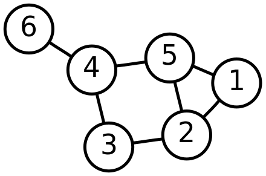

## Graph types

Many type of graphs exists, depending on their properties. **The first step in any graph problem is determining which type of graph it involves**.

### Undirected

An undirected graph $G$ is a pair $(V, E)$, where $V$ is a finite set and $E$ is a set of unordered pairs of vertices. This means that the presence of an edge $\{u, v\}$ in $E$ implies that edge $\{v, u\}$ is also in $E$.

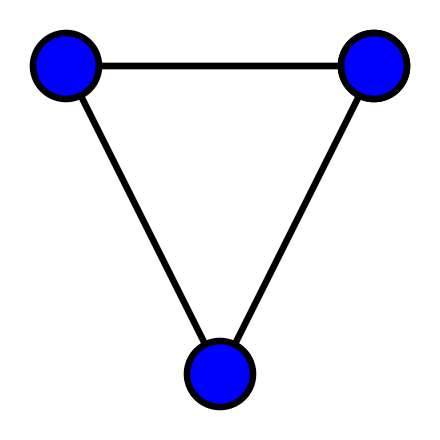

**In undirected graphs, self-loops are forbidden**, meaning that every edge consists of two distinct vertices.

### Directed

A directed graph (also called digraph) $G$ is a pair $(V, E)$, where $V$ is a finite set and $E$ is a binary relation on $V$. These differ from undirected graphs in that each edge has an orientation (so each pair in the edge set has a relevant order).

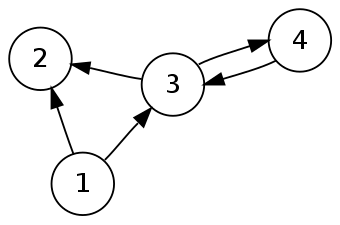

**Directed graphs can contain self-loops**. Directed graphs without loops are sometimes called **simple**. Self-loops often require special handling, so most algorithms operate exclusively on simple graphs.

Notice that both definitions for directed and undirected graphs, do not allow multiple arrows with the same source and target nodes. By turning the edge set $E$ into a multiset, we can extend the definition of graph to contain multiple arcs, obtaining a so-called **multigraph**.

### Undirected vs directed

Given an undirected graph $G = (V, E)$, the directed version of $G$ is obtained by converting each undirected edge $(u, v)$ into two directed edges $(u, v)$ and $(v, u)$.

Given an directed graph $G = (V, E)$, the undirected version of $G$ contains each edge of $G$ with their directions removed and with self-loops eliminated.

### Weighted

A weighted graph is a graph in which each edge has an associated number (the weight), given by a weight function $w : E → \mathbb{R}$.

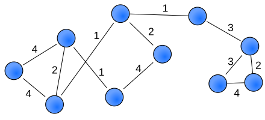

### Connected

In an undirected graph, an unordered pair of vertices $\{x, y\}$ is called connected if a path leads from $x$ to $y$. A connected graph is an undirected graph in which every unordered pair of vertices in the graph is connected.

In a directed graph, an ordered pair of vertices $(x, y)$ is called strongly connected if a directed path leads from $x$ to $y$. A strongly connected graph is a directed graph in which every ordered pair of vertices in the graph is strongly connected.

### Complete

A complete graph is an undirected graph in which every pair of distinct vertices is connected by a unique edge. A complete digraph is a directed graph in which every pair of distinct vertices is connected by a pair of unique edges (one in each direction). Simply put, complete graphs contain all possible edges.

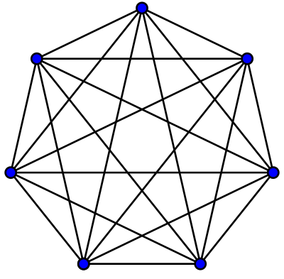

A clique of a graph $G$ is an induced subgraph of $G$ that is complete. In a complete graph (or a clique), the number of edges is equal to $|V| * (|V| -1)/2$ . This formula provides a simple way to check if a connected component of an undirected graph is a clique.

### Sparse vs Dense

A dense graph is a graph in which the number of edges is close to the maximal number of edges. The opposite, a graph with only a few edges, is a sparse graph. There is no formal definition of what constitutes a dense or sparse graph.

### Cyclic vs Acyclic

A cycle is a closed path of 3 or more vertices that has no repeating vertices except the start/end point. A graph without cycles is called an acyclic graph. **A directed graph without cycles is called a directed acyclic graph (DAG)**. This latter category has many applications in computer science, with several algorithms specifically targeting them.

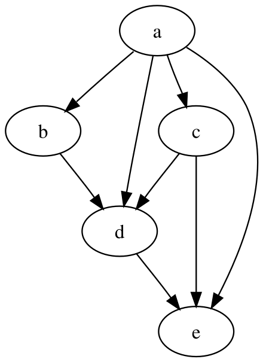

### Trees

A forest is an undirected graph in which any two vertices are connected by at most one path, or equivalently an acyclic undirected graph. A tree is an undirected graph in which any two vertices are connected by exactly one path, or equivalently a connected acyclic undirected graph.

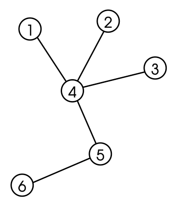

A rooted tree is a tree in which one particular node is designated as the root. Generally, rooted trees require defining a direction from the root toward the other nodes, so we can define a directed-graph form of a rooted tree, called a directed rooted tree. A directed rooted tree can either have all its edges point away from the root—in which case it is called an arborescence (or out-tree), or have all its edges point towards the root—in which case it is called an anti-arborescence (or in-tree).

### Bipartite

A bipartite graph (or bigraph) is a graph whose vertices can be divided into two disjoint and independent sets $U$ and $V$, that is, every edge connects a vertex in $U$ to one in $V$. Vertex sets $U$ and $V$ are usually called the parts of the graph. Equivalently, a bipartite graph is a graph that does not contain any odd-length cycles.

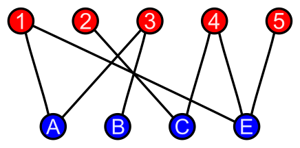

## Terminology

Given the edge $(u, v)$ of a directed graph, we say that $(u, v)$ leaves vertex $u$ and enters vertex $v$. We also say that $v$ is **adjacent** to $u$. Clearly, in an undirected graph the adjacency relation is symmetric.

The degree of a vertex in an undirected graph is the number of edges incident on it. In a directed graph, the degree of a vertex is equal to the number of edges leaving it (out-degree) plus the number of edges entering it (in-degree).

A path is a sequence of vertices connected by edges, where each vertex in the sequence is connected to the next one by an edge in the graph. If there is a path $p$ from vertex $u$ to vertex $v$, we say that $v$ is reachable by $u$ via $p$. A path is simple if all vertices are distinct.

## Graph representations

There are **two standard ways to represent a graph**: as a collection of **adjacency lists** or as an **adjacency matrix**. Either way applies to both directed and undirected graphs.

### Adjacency matrix

**An adjacency matrix is a way of representing a graph as a squared matrix of size $|V|*|V|$**. It assumes that vertices are numbered from $0$ to $|V|-1$ in some arbitrary manner.

**The adjacency matrix of an unweighted graph $G$ is the matrix $A$ such that:**  
**\- $a_{ij} = 1$ if $(i,j) ∈ E$**  
**\- $0$ otherwise**

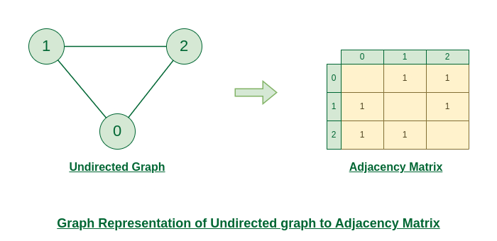

Self loops are not allowed in undirected graphs. This means that the major diagonal is always made of zeros. Moreover, since $(u, v)$ and $(v, u)$ represent the same edge, the adjacency matrix of an undirected graph is symmetric.

**The adjacency matrix of an unweighted graph can be implemented as a matrix of booleans**, since we only need to indicate wether an edge exists or not. **To represent weighted graphs, we can use a matrix of integers** instead, and store the weight $w(u,v)$ of the edge $(u,v) ∈ E$ as the entry in row $u$ and column $v$ of the matrix.

### Adjacency list

**The adjacency-list representation of a graph $G$ consists of an array $A$ of $|V|$ lists, one for each vertex in $V$. For each $u ∈ V$, the adjacency list $A[u]$ contains all the vertices $v$ such that there is an edge $(u, v) ∈ E$**. That is, $A[u]$ consists of all the vertices adjacent to $u$ in $G$.

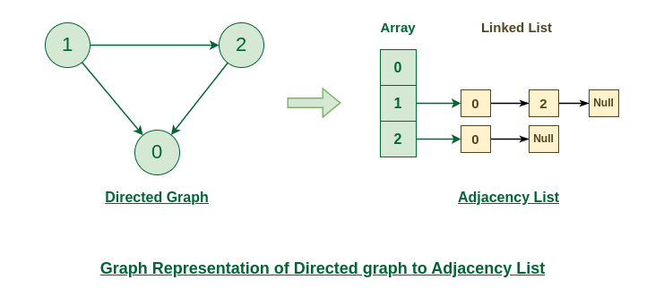

If $G$ is a directed graph, the sum of the lengths of all the adjacency lists is $|E|$. If $G$ is an undirected graph, the sum of the lengths of all the adjacency lists is $2 |E|$.

**To represent weighted graphs, we simply store the weight $w(u,v)$ of the edge $(u,v) ∈ E$ with vertex $v$ in $u$’s adjacency list**. This generally translates to a list of pairs.

### Pros vs Cons

For both directed and undirected graphs, the **adjacency-list** representation has the desirable property that **the amount of memory it requires is $Θ(V+E)$**. Finding each edge in the graph also takes $O(V+E)$ time, since each of the $|V|$ adjacency lists must be examined.

**A potential disadvantage of the adjacency-list representation is that it provides no quicker way to determine whether a given edge $(u,v)$ is present in the graph than to search for $v$ in the adjacency list $A[u]$**. An adjacency-matrix representation of the graph remedies this disadvantage, but at the cost of using asymptotically more memory. However, it's worth noting that most algorithms do not require this operations.

The adjacency matrix of a graph requires $|V^2|$ memory, independently of the number of edges in the graph. Because finding each edge in the graph requires examining the entire adjacency matrix, doing so takes $|V^2|$ time. Adjacency matrices are simpler, and so you might prefer them when graphs are reasonably small. Moreover, adjacency matrices carry a further advantage for unweighted graphs: they require only one bit per entry. This compactness can favor locality of reference.

**Because the adjacency-list representation provides a compact way to represent sparse graphs—those for which $|E|$ is much less than $|V^2|$—it is usually the method of choice**. You might prefer an adjacency-matrix representation, however, when the graph is dense—$|E|$ is close to $|V^2|$—or when you need to be able to tell quickly whether there is an edge connecting two given vertices.

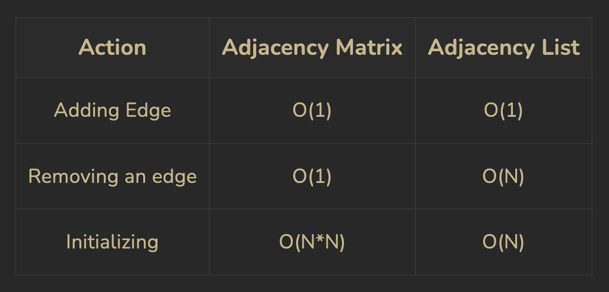

## Traversal

Graph traversal refers to the process of visiting each vertex in a graph. Tree traversal is a special case of graph traversal. Unlike tree traversal, graph traversal may require that some vertices be visited more than once, since it is not necessarily known before transitioning to a vertex that it has already been explored. Thus, **it is usually necessary to remember which vertices have already been explored by the algorithm, so that vertices are revisited as infrequently as possible. This may be accomplished by associating each vertex of the graph with a "color" or "visitation" state during the traversal**, which is then checked and updated as the algorithm visits each vertex. If the vertex has already been visited, it is ignored and the path is pursued no further; otherwise, the algorithm checks/updates the vertex and continues down its current path.

Both the depth-first and breadth-first graph searches are adaptations of tree-based algorithms, distinguished primarily by the lack of a structurally determined "root" vertex and the addition of a data structure to record the traversal's visitation state.

Note. — **If each vertex in a graph is to be traversed by a tree-based algorithm, then the algorithm must be called at least once for each connected component of the graph**. **This is easily accomplished by iterating through all the vertices of the graph, performing the algorithm on each vertex that is still unvisited when examined**.

### Breadth-first search

**Given a graph $G$ and a distinguished source vertex $s$, breadth-first search systematically explores the edges of $G$ to discover every vertex that is reachable from $s$**.

The algorithm works on both directed and undirected graphs. Breadth-first search is so named because it expands the frontier between discovered and undiscovered vertices uniformly across the breadth of the frontier. That is, starting from $s$, the algorithm first discovers all neighbors of $s$, which have distance 1. Then it discovers all vertices with distance 2, then all vertices with distance 3, and so on, until it has discovered every vertex reachable from $s$.

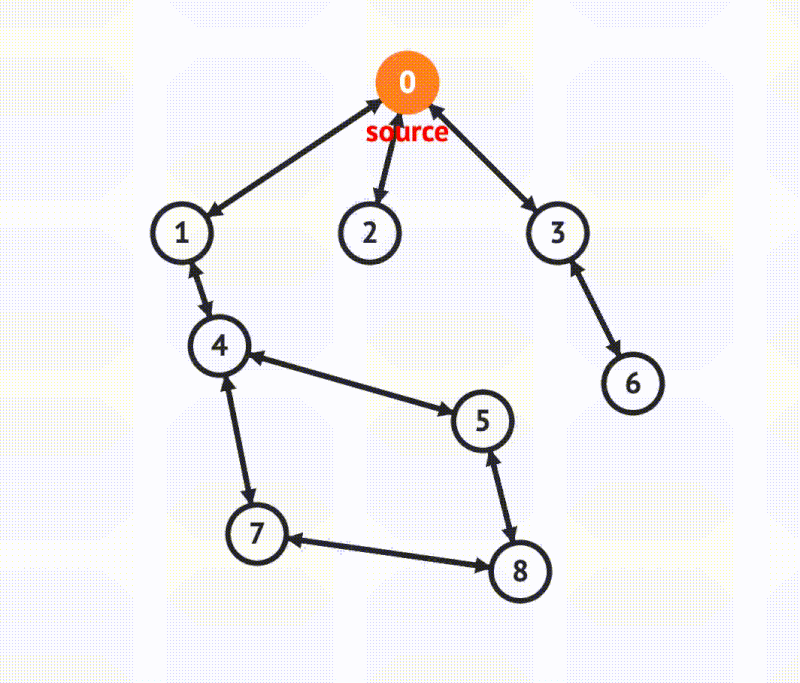

To keep track of progress, the procedure marks each vertex in one of three states:

- Undiscovered.
- Discovered. The vertex has been discovered, but we haven't yet explored all its incident edges.
- Processed. We have visited all incident edges of the vertex (all its neighbors were discovered).

Initially, all nodes are in undiscovered state. The state of each vertex then progresses from undiscovered, to discovered, to processed. **Notice that not all vertices might be reachable from the chosen source node**, so if we want to visit all the nodes we might want to apply the procedure on the remaining unvisited nodes after the first traversal.

In practice, we can most often avoid keeping track of the processed nodes: only some variations of the algorithm might benefit from this. Instead, we must keep track of the visited nodes, in order to avoid processing them again. To do so, we use a boolean vector. The algorithm starts by pushing the source into a queue and marking it as visited. Then, we start to iteratively pop from the queue. For each vertex, we must evaluate all its outgoing edges. For each edge leaving the current node, if the destination is undiscovered, we add it to the queue and mark it as discovered. Otherwise, we ignore it.

```C++
void bfs(const std::vector<std::vector<int>>& adjList, int source) {
    if (adjList.empty() || source < 0 || source >= adjList.size()) return;
    // Tracks visited nodes
    std::vector<bool> visited(adjList.size(), false);
    std::queue<int> q;
    // Start from the source vertex
    q.push(source);
    visited[source] = true;
    while (!q.empty()) {
        int curr = q.front();
        q.pop();
        cout << curr << endl;
        // Traverse all the adjacent vertices of the current vertex
        for (int neighbor : adjList[curr]) {
            if (!visited[neighbor]) {
                q.push(neighbor);
                // Mark the neighbor visited to avoid adding it to the queue again
                visited[neighbor] = true;
            }
        }
    }
}
```

A fundamental property of BFS is that **it constructs a so-called breadth-first tree, with root equal to the source vertex $s$**. Because we are traversing the tree starting from $s$, we can define a direction for each edge, from the discoverer $u$ to the discovered $v$. This equates to a parent relationship. In other terms, whenever an undiscovered vertex $v$ is found while processing the discovered vertex $u$, we add the edge $(u, v)$ to the BFS tree, and we say that $u$ is the parent of $v$.

**In unweighted graphs, this tree defines a shortest path from the root to every other node in the tree**. Therefore, **the BFS procedure finds the shortest distance from a given source vertex $s$ to each vertex in the graph**. **While BFS can be used to solve shortest-path problems in unweighted graphs, weighted graphs require different algorithms, such as Bellman-Ford or Dijkstra's algorithms**.

In the BFS procedure, we can keep track of the breadth-first tree using a vector. This vector has size equal to $|V|$. The index of a cell in the vector represents the vertex, and the content represents the parent of that vertex. It is easy to extend the BFS procedure to populate this vector.

```C++
std::vector<int> bfs(const std::vector<std::vector<int>>& adjList, int source) {
    if (adjList.empty() || source < 0 || source >= adjList.size()) return;
    // Tracks visited nodes
    std::vector<bool> visited(adjList.size(), false);
    std::vector<int> parent(adjList.size(), -1);
    std::queue<int> q;
    // Start from the source vertex
    q.push(source);
    visited[source] = true;
    while (!q.empty()) {
        int curr = q.front();
        q.pop();
        cout << curr << endl;
        // Traverse all the adjacent vertices of the current vertex
        for (int neighbor : adjList[curr]) {
            if (!visited[neighbor]) {
                q.push(neighbor);
                // Mark the neighbor visited to avoid adding it to the queue again
                visited[neighbor] = true;
                parent[neighbor] = curr;
            }
        }
    }
    return parent;
}
```

The BFS procedure so constructed returns the parent vector. **We can reconstruct the path from the root to each vertex by following the chain of ancestors**. We have to proceed backwards, going from the target node back to the source, by following the chain of parents. We can do so iteratively, by remembering to reverse the result at the end, or we can let recursion reverse it for us.

```C++
std::vector<int> extractMinPathIter(const std::vector<int>& parent, int dest) {
    std::vector<int> path;
    for (int curr = dest; curr != -1; curr = parent[curr]) path.push_back(curr);
    std::reverse(path.begin(), path.end());
    return path;
}
```

### Depth-first search

Like breadth-first search, depth-first search marks vertices during the search to indicate their state. As with breadth-first search, a boolean vector that tracks visited nodes is enough for the basic implementation of the algorithm. DFS is easier to implement, since its recursive nature allows us to leverage the call stack instead of manually handling a stack. **With DFS, we can implement a pre-order or a post-order traversal**:

- Pre-order: we process vertex $v$ before traversing any of its outgoing edges.
- Post-order: we process vertex $v$ only after processing all its outgoing edges.

```C++
void dfsHelper(const std::vector<std::vector<int>>& adjList, int source, std::vector<bool>& visited, bool postorder = false) {
    visited[source] = true;
    if (!postorder) cout << source << endl;
    for (int neighbor : adjList[source]) {
        if (!visited[neighbor]) {
            dfsGraphApplyHelper(adjList, neighbor, visited, callback, postorder);
        }
    }
    if (postorder) cout << source << endl;
}

void dfs(const std::vector<std::vector<int>>& adjList, int source, GCallback callback) {
    std::vector<bool> visited(adjList.size(), false);
    detail::dfsHelper(adjList, source, visited, true);
}
```

**DFS can naturally be extended to timestamp every vertex**. Each vertex $v$ has **two timestamps: the first timestamp records when $v$ is first discovered, and the second timestamp records when the search finishes examining $v$ ’s adjacency list**. These timestamps are integers between $0$ and $2 |V|-1$, since there is one discovery event and one finishing event for each of the $|V|$ vertices. These timestamps provide important information about the structure of the graph.

```C++
void dfsTimestampHelper(const std::vector<std::vector<int>>& adjList, int source, std::vector<bool>& visited, std::vector<int>& discovery, std::vector<int>& finish, int& timestamp) {
    visited[source] = true;
    discovery[source] = timestamp++;
    for (int neighbor : adjList[source]) {
        if (!visited[neighbor]) {
            dfsTimestampHelper(adjList, neighbor, visited, discovery, finish, timestamp);
        }
    }
    finish[source] = timestamp++;
}

std::pair<std::vector<int>, std::vector<int>> dfsTimestamp(const std::vector<std::vector<int>>& adjList, int source) {
    std::vector<bool> visited(adjList.size(), false);
    int timestamp = 0;
    std::vector<int> discovery(adjList.size(), -1);
    std::vector<int> finish(adjList.size(), -1);
    detail::dfsTimestampHelper(adjList, source, visited, discovery, finish, timestamp);
    return {discovery, finish};
}
```

An interesting property is that discovery and finish times have parenthesis structure. If the DFS procedure were to print a left parenthesis $"(u"$ when it discovers vertex $u$ and to print a right parenthesis $"u)""$ when it finishes $u$, then the printed expression would be well formed in the sense that the parentheses are properly nested.

Timestamps also allow us to understand the relationship between vertices. Suppose that $x$ is an ancestor of $y$ in the DFS tree. Then, we must necessarily enter $x$ before $y$, and exit $y$ before we exit $x$.

Most notably, **the DFS procedure allows us to categorize edges in four types**:

1.  Tree edges are edges that discover new vertices, that is $(u, v)$ is a tree edge if $v$ was first discovered by exploring edge $(u, v)$.
2.  Back edges are those edges $(u, v)$ connecting a vertex $u$ to an ancestor $v$ in a depth-first tree.
3.  Forward edges are those non-tree edges $(u, v)$ connecting a vertex $u$ to a proper descendant $v$ in a depth-first tree.
4.  Cross edges are all other edges.

For undirected graphs, forward edges and cross edges never occur. This means that **DFS partitions an undirected graph's nodes between tree edges and back edges**.

## Algorithms on unweighted graphs

### Shortest distance between two vertices

The best way to find the shortest distance between a source vertex $u$ and a target vertex $v$ in an unweighted graph $G$ is to use a modified version of breadth-first search. We simply need to add a vector of integers with size $|V|$, recording the distance of each vertex from the source. Before pushing a new neighbor to the queue, we can compute its distance as $1 + dist[curr]$. If the neighbor happens to be the target vertex, we directly return this distance.

### Reachable vertex

This can be achieved with either a DFS or BFS traversal. If the current vertex is equal to the target, we return true.

### Detect cycle

Detecting cycles is done by means of DFS, but the procedure differs between directed and undirected graphs.

For undirected graphs the algorithm is very similar to standard DFS. A cycle exists if we find a back edge that connects a vertex to one of its ancestors in the DFS tree. Notice that each node is adjacent to its parent, which does not count as a cycle. Hence, when exploring a vertex, we check if any adjacent vertex is already visited and is not the parent of the current vertex. If so, we return true. If DFS traversal is done on all vertices and no cycles are detected, false is returned.

This algorithm does not work for directed graphs. If we come to an adjacent node that has already been visited, it does not necessarily mean that there is a cycle.

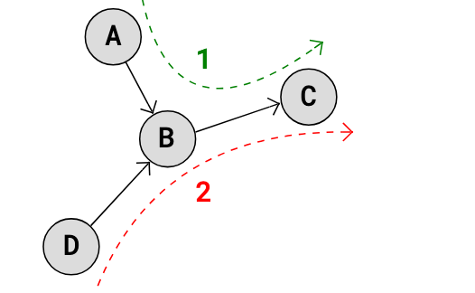

In a directed graph, a cycle occurs when a vertex is reachable from itself following the direction of the edges. This means that during DFS, if we encounter a vertex that is part of the current recursion stack (i.e., still being explored), a cycle exists because it indicates a "back edge" pointing back to an ancestor (since all ancestors of a node are present in recursion call stack during DFS). To implement this, we simply need to add a boolean vector that keeps track of the nodes currently in the recursion stack. If from a vertex we find a previously visited neighbor which is in the recursion stack, we return true.

### Clone

Cloning requires a special algorithm only when the graph is represented as a linked structure. Otherwise, the copy-constructor provided by the standard data structures can trivially achieve the result. Cloning is performed by combining depth-first search with the use of a hash map. The key intuition is that of using a hash map that keeps track of the visited nodes and their respective clones. In the DFS procedure, if the current node is already in the map, we can return its associated clone. Otherwise, the node has not been visited yet. We can therefore clone it and then recursively call the clone procedure on each of its neighbors. Finally, we return the newly cloned node.

### Connected components

Finding components in undirected graphs is trivially achieved by means of depth first search. We apply DFS from an arbitrarily selected source, keeping track of the visited nodes. The visited nodes at the end of the traversal determine a connected component. By iteratively applying DFS to the remaining unvisited nodes, we can detect all other connected components.

The problem is different for directed graphs, as there are two types of components:

1.  Weakly Connected Components
2.  Strongly Connected Components (SCC)

Typically, we are interested in finding strongly connected components. In a SCC, for each vertex $v$, all vertices are reachable from $v$, and all vertices can reach $v$. DFS tests the first condition, which in undirected graphs is equivalent to the second condition, due to the symmetric adjacency relation. For directed graphs instead, the first condition does not guarantee the second, therefore we need a different approach. There are two main algorithms for detecting SCCs: **Kosaraju**’s algorithm and **Tarjan**'s algorithm. The first works in two passes, while the second finds the result in a single pass.

### Topological sort

A topological sort of a directed graph is a linear ordering of its vertices such that for every directed edge $(u,v)$ from vertex $u$ to vertex $v$, $u$ comes before $v$ in the ordering. Precisely, **a topological sort is a graph traversal in which each node $v$ is visited only after all its dependencies are visited**.

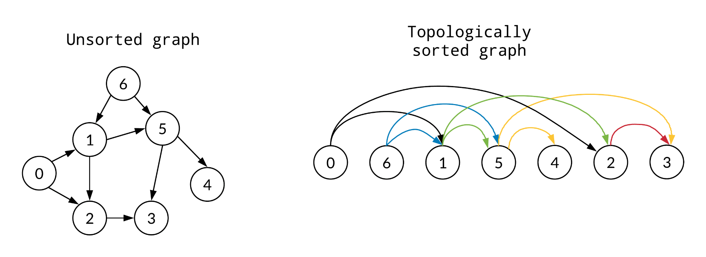

**A topological ordering is possible if and only if the graph has no directed cycles**, that is, if it is a directed acyclic graph (**DAG**)**. Any DAG has at least one topological ordering**, and algorithms are known for constructing a topological ordering of any DAG in linear time. Topological sorting is possible even when the DAG has disconnected components.

One well-known algorithm for topological sorting is **Kahn**'s algorithm, which works by computing the in-degree of each node and iteratively removing the nodes with no dependencies. However, we can achieve the same result using **DFS** with slight modifications. DFS ensures that a node is completely processed (i.e., all its neighbors have been visited) before marking it as finished. By pushing nodes onto a container after all their neighbors have been explored (post-order traversal), we guarantee that nodes with outgoing edges are pushed to the container after the nodes they depend on. Thus, we obtain a reversed topological order, and get the final result by reversing the container. Notice that, if the input graph is not guaranteed to be acyclic, this procedure can be integrated with the cycle detection procedure for directed graphs.

### Tree center

The center of a graph is the set of all vertices of minimum eccentricity. The eccentricity of a vertex $v$ is the greatest distance between $v$ and any other vertex in the graph. So, in other terms, the center is the set of all vertices $u$ where the greatest distance $d(u,v)$ to other vertices $v$ is minimal. Thus, vertices in the center minimize the maximal distance from other points in the graph.

Finding the center of a generic graph can be complex, because a generic graph can have cycles and disconnected components. However, finding the center of a tree (a connected acyclic undirected graph) is much simpler. It can be an interesting problem for choosing a suitable vertex for rooting the tree.

By definition, the longest path in a tree is given by its diameter. Intuitively, the center of the tree diameter will be the center of the tree as well. Now if the diameter consists of an odd number of nodes, then there exists only 1 center. If the diameter consists of an even number of nodes, then there are 2 center nodes.

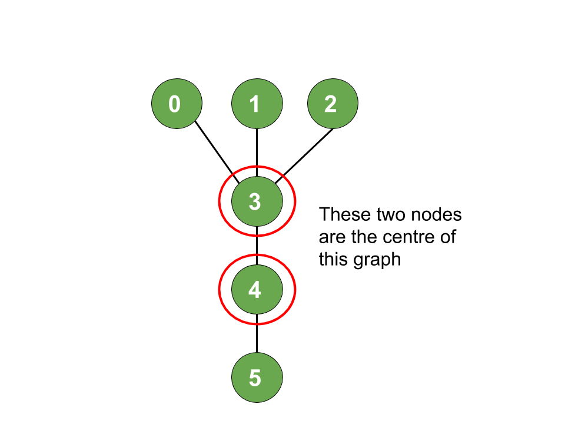

One approach for finding the center is based on iteratively removing the leaves of the graph, until only one or two nodes remain. To do so, we first start by computing the degree of each node. The leaves are all the nodes with degree 1. We push all leaves in a queue, and start processing them one by one. For each, we remove it from the leaves queue and update the degree of every neighbor by subtracting one. If the degree of any neighbor becomes one, it is pushed to the leaves queue. The procedure continues until the leaves queue size becomes 1 or 2.

### Eulerian path

A Eulerian path (or Eulerian trail) is a path in a finite graph that visits every edge exactly once (**allowing for revisiting vertices**). Similarly, an Eulerian circuit (or Eulerian cycle) is an Eulerian path that starts and ends on the same vertex.

An undirected graph has a Eulerian cycle if and only if every vertex has even degree, and all of its vertices with nonzero degree belong to a single connected component.  
A directed graph has an Eulerian trail if and only if at most one vertex has $(OutDegree) − (InDegree) = 1$, at most one vertex has $(InDegree) − (OutDegree) = 1$, every other vertex has equal in-degree and out-degree, and all of its vertices with nonzero degree belong to a single connected component of the underlying undirected graph.

Hierholzer's algorithm can be used to find a Eulerian path or cycle in $O(E)$ time.

## Union find

A disjoint-set data structure (also called union-find) is a data structure that stores a collection of disjoint (non-overlapping) sets. A disjoint-set maintains a collection $S = {S_1, S_2, ..., S_k}$ of disjoint dynamic sets. Each set is identified by a representative, which is an arbitrarily chosen member of the set.

Given an object $x$, a union-find supports the following operations:

- `MAKE-SET(x)`, where $x$ does not already belong to some other set, creates a new set whose only member (and thus representative) is $x$.
- `UNION(x, y)`, unites two disjoint, dynamic sets that contain $x$ and $y$, say $S_x$ and $S_y$, into a new set that is the union of these two sets. The representative of the resulting set is any member of $S_x ∪ S_y$ .
- `FIND-SET(x)`, returns a pointer to the representative of the unique set containing $x$.

Initially, the data structure will contain $n$ disjoint sets of one element. Afterwards, each `UNION` operation reduces the number of sets by 1. After $n - 1$ `UNION` operations, therefore, only one set remains, and so at most $n - 1$ `UNION` operations can occur. Notice that no inverse operation is present, meaning an object can never be removed from its set.

### Implementation

There are two classic way to represent a disjoint-set. The first is a linked list representation, where each set is represented by its own linked list. The second uses a forest, and is the fastest implementation. We will therefore focus on the latter.

The typical implementation of a disjoint-set represents sets by rooted trees, with each node containing one member and each tree representing one set. In a disjoint-set forest, each member points only to its parent (**forest of in-trees**).

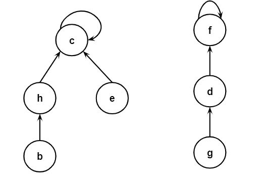

At the simplest level, the basic operations work in the following way:

- `MAKE-SET` creates a tree with just one node.
- `FIND-SET` follows parent pointers until it reaches the root of the tree. The nodes visited on this simple path toward the root constitute the find path.
- `UNION` causes the root of one tree to point to the root of the other.

However, augmenting these procedures with **two simple heuristics**, we can achieve an asymptotically optimal behavior.

The first heuristic is called **union by rank**. When merging two trees, we want to minimize the depth of the resulting tree. In fact, the deeper the tree, the longer it takes to find the root of any node, increasing the time for `FIND-SET`. In order to limit the final depth, we try to always attach the smaller tree under the larger tree, so that the result remains as flat as possible. To easily identify the smaller tree, we maintain a rank for each node, which is an upper bound on the height of the node. The rank of a node represents the maximum possible height of a subtree rooted at a given node. When we perform a `UNION`, the rank helps us decide which tree to attach under which root. The reason why the rank is an upper bound is that its value is only updated during `UNION`, but the height of a tree can change also during `FIND-SET` due to the second heuristic.

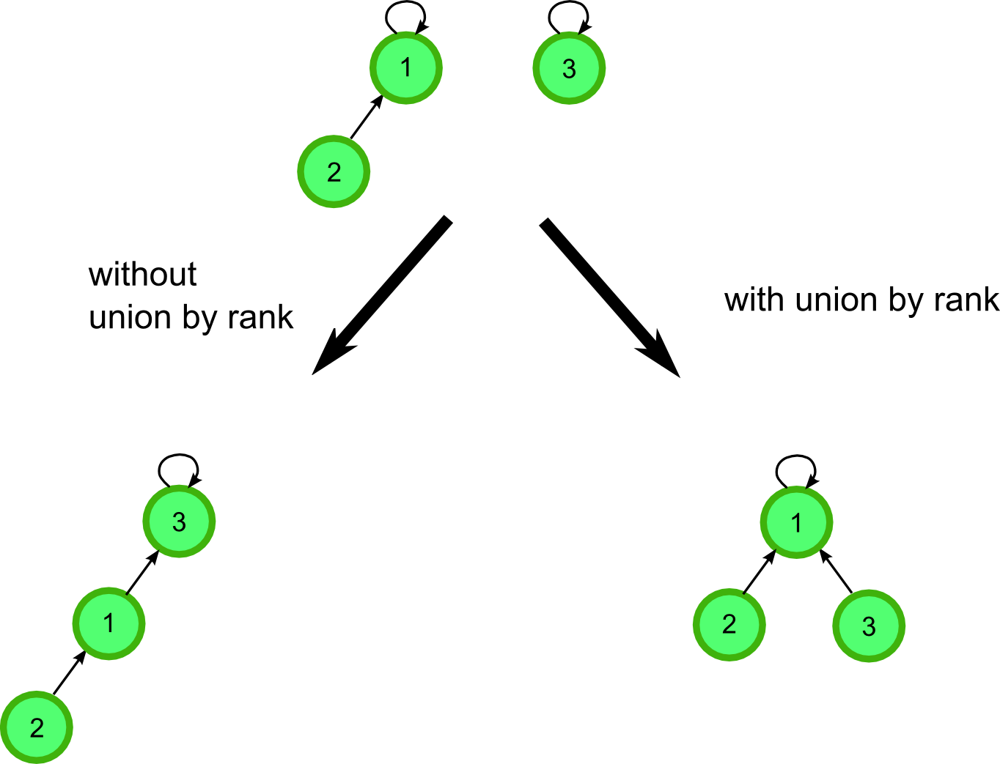

The second heuristic is called **path compression**. During `FIND-SET`, each node on the find path is modified to point directly to the root.

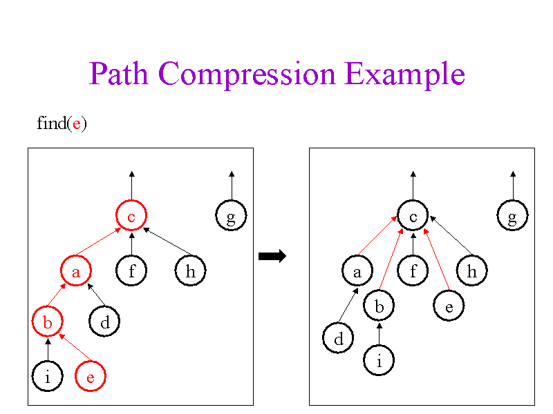

In the implementation, we can avoid using a linked structure and rely on arrays instead. We only need one vector holding the parent of each node and another containing the rank of each node. Both `FIND-SET` and `UNION` can then be implemented by manipulating these vectors.

### Complexity analysis

To perform a sequence of $m$ addition, union, or find operations on a disjoint-set forest with $n$ nodes requires total time $O(mα(n))$, where $α(n)$ is the extremely slow-growing inverse Ackermann function. For the vast majority of applications, $α(n) ≤ 4$, so **the running time can be considered linear in the number of operations**. Notice that disjoint-set forests do not guarantee constant time performance on a per-operation basis. Individual union and find operations can take longer than a constant times $α(n)$ time, but each operation causes the disjoint-set forest to adjust itself so that successive operations are faster. Disjoint-set forests are both asymptotically optimal and practically efficient.

## Algorithms on weighted graphs

### Minimum spanning tree

A minimum spanning tree (MST) or minimum weight spanning tree is a subset of the edges of a connected, edge-weighted undirected graph that connects all the vertices together, without any cycles and with the minimum possible total edge weight. 

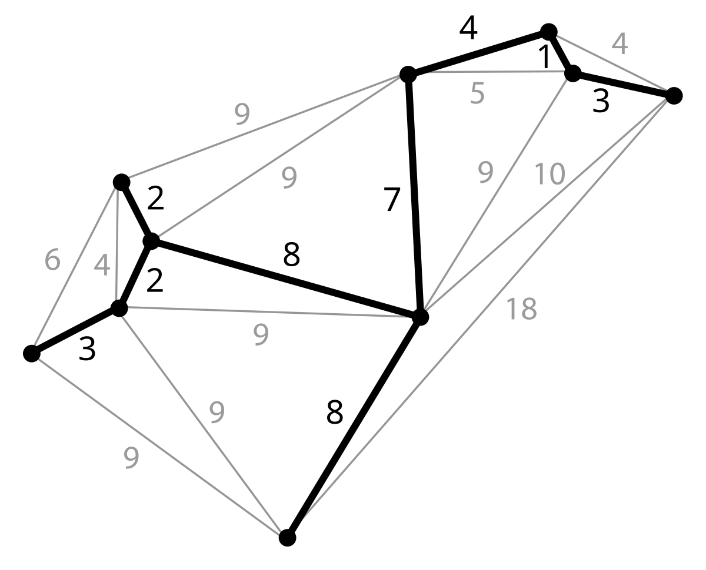

**If there are $n$ vertices in the graph, then each spanning tree has $n − 1$ edges**. If each edge has a distinct weight then there will be only one, unique minimum spanning tree. More generally, if the edge weights are not all distinct then only the set of weights in minimum spanning trees is certain to be unique; it is the same for all minimum spanning trees.

The two main algorithms to find the MST are Prim's and Kruskal's. Both use a greedy approach to the problem, although they differ in how they apply this approach. The MST is built one step at a time, starting from an empty set $A$, which represents a subset of the MST. At each iteration, the procedure determines an edge $(u, v)$ that can be added safely to $A$, meaning that $A ∪ {(u, v)}$ is also a subset of a MST. The key to solving this problem is being able to efficiently find safe edges, and this is where the two algorithms differ.

#### Kruskal's algorithm

In Kruskal's algorithm, the set $A$ is a forest whose vertices are all those of the given graph. The safe edge added to $A$ is always a lowest-weight edge in the graph that connects two distinct components (two trees).

Kruskal's algorithm is divided in 3 steps:

1.  Sort all edges in the graph by weight.
2.  Create a Union Find data structure with the vertices of the graph.
3.  Run a loop on each edge of the graph, starting from the one with the smallest weight. If the two endpoints of the edge belong to the same set, we skip this edge. Otherwise we merge the two vertices in the union find and add that edge to the MST. The algorithm terminates when the MST contains $n-1$ nodes.

Kruskal's algorithm qualifies as a greedy algorithm because at each step it adds to the forest an edge with the lowest possible weight.

The algorithm scans each edge just once, and Union Find operations have on average constant time. Therefore, the complexity is dominated by the initial sorting, which takes $O(E log E)$.

#### Prims's algorithm

In Prim's algorithm, the set $A$ forms a single tree. The safe edge added to $A$ is always a lowest-weight edge connecting the tree to a vertex not in the tree.

At a high level, the algorithm can be summarized in three steps:

1. Initialize a tree with a single vertex, chosen arbitrarily from the graph.
2. Grow the tree by one edge: of the edges that connect the tree to vertices not yet in the tree, find the minimum-weight edge, and transfer it to the tree.
3. Repeat step 2 (until all vertices are in the tree).

In order to efficiently select a new edge to add into tree $A$, the algorithm maintains a min-priority queue of all vertices that are not in the tree. Moreover, it uses a boolean visited array to mark which vertices have been included in the MST. 

For each of the $V$ vertices, the algorithm extracts the minimum vertex from a priority queue, which takes $O(log⁡V)$ time. Additionally, for each of the $E$ edges, it may update the priority queue with a new minimum edge, also taking $O(log⁡V)$. Therefore, the total complexity comes from $V$ extractions and up to $E$ updates, resulting in $O((V+E)log⁡V)$.

### Dijkstra's algorithm

Dijkstra's algorithm is an algorithm for finding the shortest path from a given source node to every other node in a graph. It can also be used to find the shortest path to a specific destination node, by terminating the algorithm once the shortest path to the destination node is known. It can only be applied on graphs that don't contain any edges with negative weight.

It is a generalization of the classic BFS that uses a greedy approach. It substitutes the queue usage with a min-priority queue, extracting at each iteration the minimum path known so far. Because the algorithm chooses at each iteration the closest vertex to add to the path, it classifies as a greedy algorithm.

A key technique used by this algorithm is that of **relaxation**. For each vertex $v$, the algorithm stores an upper bound on the weight of a shortest path from source $s$ to $v$. We can call this value a shortest-path estimate. The process of relaxing an edge $(u, v)$ consists of testing whether going through vertex $u$ improves the shortest path to vertex $v$ found so far and, if so, updating the shortest-path estimate.

The procedure can be summed up in the following steps:

1. Assign to every node an estimated distance from the source: for the starting node, it is zero, and for all other nodes, it is infinity, since initially no path is known to these nodes.
2. Push the source node into a priority queue (min-heap) with a distance of 0.
3. While the priority queue is not empty, extract the node $u$ with the smallest distance from the queue.
4. If the extracted distance $d$ is greater than the current recorded distance for $u$, skip this node (continue).
5. For each neighboring node $v$ of $u$, calculate the potential new distance through $u$. If this new distance is shorter than the current recorded distance for $v$, update $dist[v]$ (relaxation).
6. Push the updated distance of $v$ into the priority queue.
7. Continue this process until the priority queue is empty.
8. The final $dist$ array contains the shortest distances from the source to all other nodes.

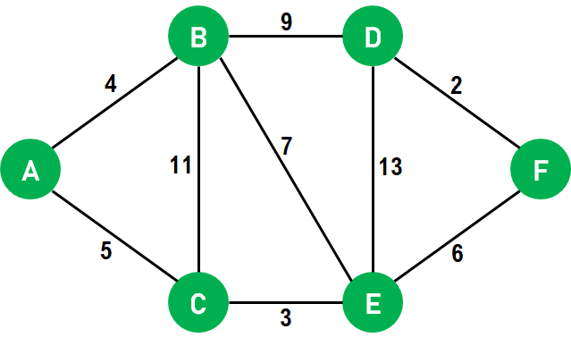

Notice that a shortest path cannot contain a cycle, since removing the cycle from the path produces a path with the same source and destination vertices and a lower path weight. Therefore, since a path can traverse at most $V$ edges, any shortest path contains at most $V - 1$ edges.

The complexity bound depends mainly on the data structure used to represent the priority queue. In sparse graphs (where the number of edges $|E|$ is less than $|V|^{2}$), a min-heap is efficient for extracting the minimum distance. The priority queue can hold up to $|V|$ vertices, and each extraction operation takes $O(log V)$ time. Additionally, for each of the $|E|$ edges, the relaxation step may result in pushing a new entry into the heap, which also takes $O(log V)$ time. As a result, the overall time complexity of the algorithm is $O((E + V) log V)$.