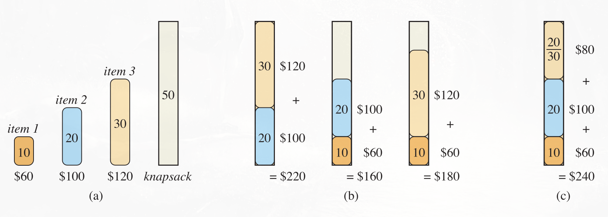

A heuristic is a technique designed for problem solving more quickly when classic methods are too slow. This is achieved by trading optimality, completeness, accuracy, or precision for speed. **A heuristic, is a function that ranks alternatives in search algorithms at each branching step based on available information to decide which branch to follow**.

**A greedy algorithm is any algorithm that follows the problem-solving heuristic of making the locally optimal choice at each stage, in the hope that this choice leads to a globally optimal solution**. **Greedy algorithms do not always yield optimal solutions, but for many problems they do**. **In others, they do not produce a globally optimal solution, but they can yield locally optimal solutions that approximate a globally optimal solution in a reasonable amount of time**.

A greedy algorithm obtains an optimal solution to a problem by making a sequence of choices. At each decision point, the algorithm makes the choice that seems best at the moment. This heuristic strategy does not always produce an optimal solution, but sometimes it does.

## Designing greedy algorithms

Greedy algorithms are used to solve optimization problems, and can typically be designed according to the following sequence of steps:

1.  Cast the optimization problem as one in which you make a choice and are left with one subproblem to solve.
2.  Prove that there is always an optimal solution to the original problem that makes the greedy choice, so that the greedy choice is always safe.
3.  Demonstrate optimal substructure by showing that, having made the greedy choice, what remains is a subproblem with the property that if you combine an optimal solution to the subproblem with the greedy choice you have made, you arrive at an optimal solution to the original problem.

## Properties

**If a greedy algorithm can be proven to yield the global optimum for a given problem class, it typically becomes the method of choice** because it is faster than other optimization methods like dynamic programming.

Unfortunately, **there isn't a systematically repeatable way to determine if a greedy heuristics solves a given problem optimally**. However, the **two key ingredients** to determine this are the **greedy-choice property** and **optimal substructure**.

### Greedy-choice property

**Greedy-choice property: you can assemble a globally optimal solution by making locally optimal (greedy) choices**. In other words, **when you are considering which choice to make, you make the choice that looks best in**  
**the current problem, without considering results from subproblems**. Greedy algorithms iteratively make one greedy choice after another, reducing each given problem into a smaller one. **This means a greedy algorithm never reconsiders its choices**. This is unlike dynamic-programming, which makes decisions based on all the decisions made in the previous stage and may reconsider the previous stage's algorithmic path to the solution.

**Here is where greedy algorithms differ from dynamic programming. In dynamic programming, you make a choice at each step, but the choice usually depends on the solutions to subproblems**. Consequently, you typically solve dynamic-programming problems in a bottom-up manner, progressing from smaller sub-problems to larger subproblems. **In a greedy algorithm, you make whatever choice seems best at the moment and then solve the subproblem that remains. The choice made by a greedy algorithm may depend on choices so far, but it cannot depend on any future choices or on the solutions to subproblems**. **Thus, unlike dynamic programming, which solves the subproblems before making the first choice, a greedy algorithm makes its first choice before solving any subproblems**.

### Optimal substructure

**A problem is said to have optimal substructure if an optimal solution can be constructed from optimal solutions of its subproblems**. We can assume we have arrived at a subproblem by having made the greedy choice in the original problem. With this assumption, we can argue that an optimal solution to the subproblem, combined with the greedy choice already made, yields an optimal solution to the original problem. This scheme implicitly uses induction on the subproblems to prove that making the greedy choice at every step produces an optimal solution.

## Examples

### Fractional Knapsack problem

The 0-1 knapsack problem is a classic dynamic programming algorithm. In the fractional knapsack problem, the setup is the same, but the thief can take fractions of items, rather than having to make a binary (0-1) choice for each item. **A greedy strategy works to solve the fractional knapsack problem, but not the 0-1 problem**.

To solve the fractional problem, first compute the value per pound $v_i /w_i$ for each item. Obeying a greedy strategy, the thief begins by taking as much as possible of the item with the greatest value per pound. If the supply of that item is exhausted and the thief can still carry more, then the thief takes as much as possible of the item with the next greatest value per pound, and so forth, until reaching the weight limit $W$. Thus, by sorting the items by value per pound, the greedy algorithm runs in $O(n lg n)$ time.

The greedy heuristic does not work in the 0-1 problem, as the thief might be unable to fill the knapsack to capacity, so that the empty space lowers the effective value per pound of the load. **In the 0-1 problem, when you consider whether to include an item in the knapsack, you must compare the solution to the subproblem that includes the item with the solution to the subproblem that excludes the item before you can make the choice**. The problem formulated in this way gives rise to many overlapping sub-problems, a hallmark of dynamic programming.