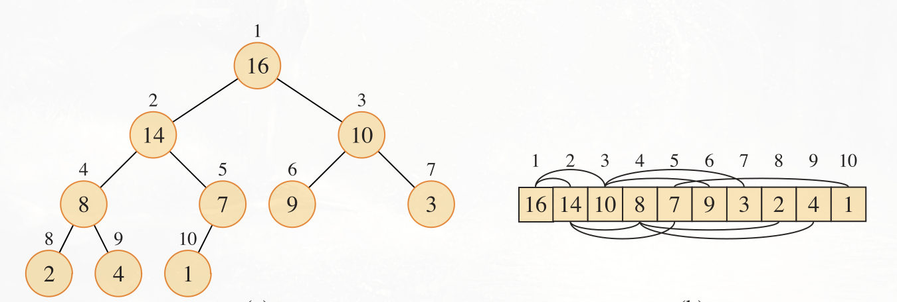
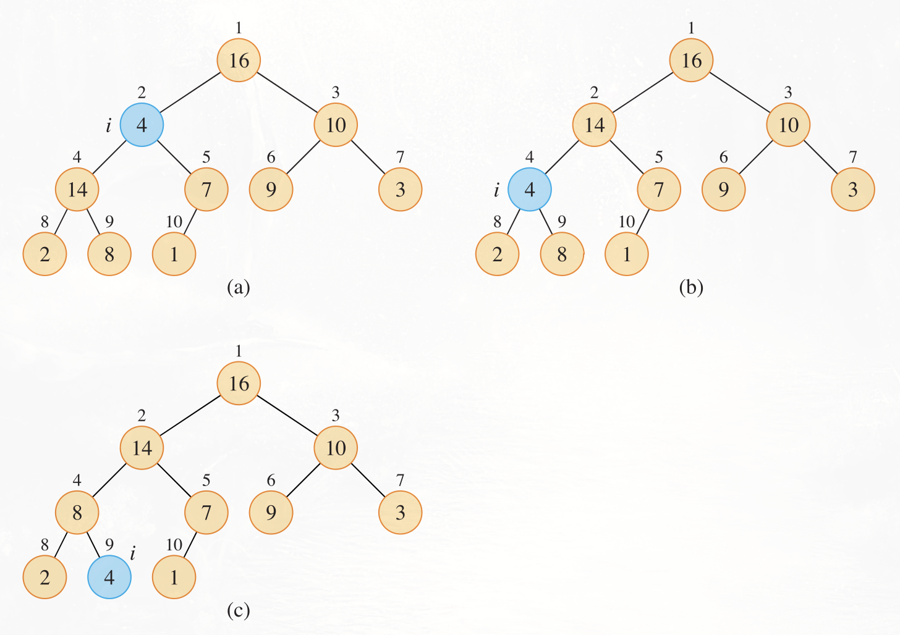
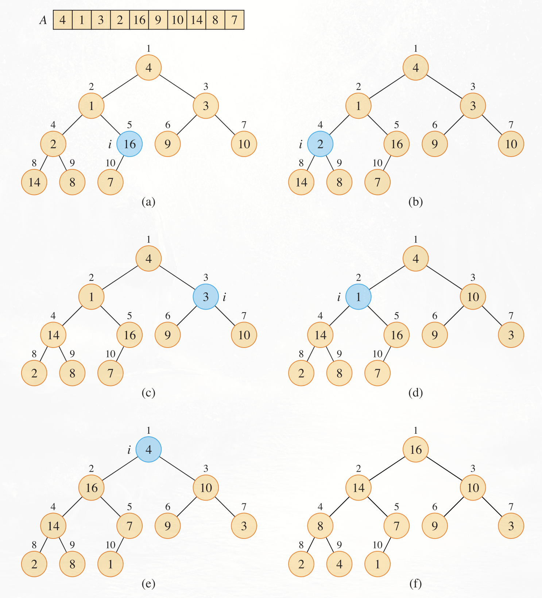
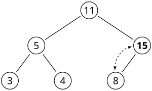
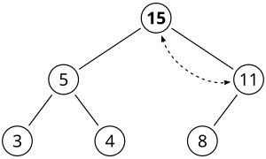

A heap is a tree-based data structure. The most common implementation of a heap is the binary heap. A binary heap is defined as a binary tree with two additional constraints:

1.  Shape property: a binary heap is a **complete binary tree**; that is, all levels of the tree, except possibly the last one (deepest) are fully filled, and, if the last level of the tree is not complete, the nodes of that level are filled from left to right.
2.  **Heap property**: the key stored in each node is either greater than or equal to (≥) or less than or equal to (≤) the keys in the node's children, according to some total order.

A binary heap is typically **implemented as an array**.

Given the index $i$ of a node, the parent and the children of a node can be found by simple arithmetic on array indices. Specifically:

- Parent: $(i-1) / 2$
- Left child: $2i + 1$
- Right child: $2i + 2$

Notice that these operations can be implemented efficiently by using shifts.

There are **two kinds of binary heaps**:

1.  **Max Heap**. The max-heap property is that for every node $i$ other than the root, **$A[PARENT(i)]≥A[i]$**. Thus, **the largest element in a max-heap is stored at the root**, and the subtree rooted at a node contains values no larger than that contained at the node itself.
2.  **Min Heap**. The min-heap property is that for every node $i$ other than the root, **$A[PARENT(i)]≤A[i]$**. This means that **the smallest element in a min-heap is at the root**.

### Operations

#### Heapify-down

The **`heapify-down`** procedure is one of the main operations on a heap. This **maintains the heap property** (which can be max or min depending on the type of the heap). For simplicity, we will only treat max heap. The inputs to the procedure are an array A and an index $i$ into the array. When it is called, `heapify-down` assumes that the binary trees rooted at $LEFT(i)$ and $RIGHT(i)$ are max-heaps, but that $A[i]$ might be smaller than its children, thus violating the max-heap property. `heapify-down` lets the value at $A[i]$ float down in the max-heap so that the subtree rooted at index $i$ obeys the max-heap property. Each step determines the largest of the elements $A[i]$, $A[LEFT(i)]$, and $A[RIGHT(i)]$ and stores the index of the largest element in $largest$. Positions $i$ and $largest$ swap their contents, which causes node $i$ and its children to satisfy the max-heap property. The node indexed by largest , however, just had its value decreased, and thus the subtree rooted at largest might violate the max-heap property. Consequently, `heapify-down` calls itself recursively on that subtree. The complexity of this procedure is $O(log n)$.

#### Build-heap

The procedure `build-heap` converts an array into a heap by calling `heapify-down` in a bottom-up manner. The key intuition is that **the array elements from $⌊n/2⌋$ and onwards are all leaves of the tree**. By iterating backwards through the remaining nodes (so from $(n/2)-1$ to $0$ included) we can construct a heap by applying `heapify-down` to each node.

This operation has $O(n)$ complexity, meaning **we can build a heap from an unordered array in linear time**. 

#### Heapify-up

This operation restores the heap property by comparing a node with its parent. If the two nodes are not in correct order, they get swapped. This operation repeats until the current element and its parent are in the right order, or the root is reached.

#### Insert

To insert an element to a heap, we perform the following steps:

1.  Add the element to the bottom level of the heap at the leftmost open space. This can be done by simply appending the new element to the end of the array.
2.  Perform the `heapify-up` procedure on the newly insterted element (which has index $n-1$)

#### Extract

This operation returns the value of the root of the tree after removing it. It is done in two opearations:

1. Store the value of the root.
2. Replace the root with the last element of the array.
3. Pop back the array (erase the last element)
4. Apply `heapify-down` to the root
5. Return the previously stored root value

#### Remove

This operation removes the root of the tree. It is performed in the same way as extract, except there is no need to store the value of the root and to return it.

