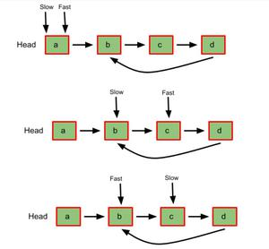
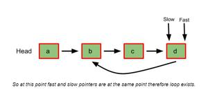

### Loop detection

Floyd's cycle-finding algorithm is a pointer algorithm that uses only two pointers, which move through the sequence at different speeds. This algorithm is used to find a loop in a linked list. **It uses two pointers one moving twice as fast as the other one**. The faster one is called the fast pointer and the other one is called the slow pointer.

While traversing the linked list one of these things is guaranteed to occur:

- The Fast pointer may reach the end (NULL) this shows that there is no loop in the linked list.
- The Fast pointer again catches the slow pointer at some time therefore a loop exists in the linked list.

  
  
So, to detect if a cycle exists in the list, all we need is to create two pointers that start at the head of the list. Then we create a loop that scans the list, moving the slow pointer once and the fast pointer twice at each iteration. If the fast pointer becomes null, then there is no cycle. Otherwise, the two pointers will eventually become equal. Here is a C++ implementation:

```C++
template <typename T>
bool checkCycle(SListNode<T>* head) {
    // We can use head directly as slow pointer
    SListNode<T>* fast = head;
    while(fast && fast->next) {
        head = head->next;
        fast = fast->next->next;
        if (head == fast) return true;
    }
    return false;
}
```

We can go even further and find the node where the cycle starts from. To do them, we first detect if a cycle exists using the previous algorithm. If so, we leave the fast pointer at its current position and reset the slow pointer to the head of the list. We then start a new loop and move both pointer one unit at each iteration. The pointers will encounter at the node where the cycle originates. Here is a C++ implementation:

```C++
template <typename T>
SListNode<T>* findCycle(SListNode<T>* head) {
    SListNode<T>* slow = head; 
    SListNode<T>* fast = head;
    // Check if the list has a loop
    while(fast && fast->next) {
        slow = slow->next;
        fast = fast->next->next;
        if (slow == fast) break;
    }
    // We didn't break out of the previous loop, so there is no cycle
    if (slow != fast) return nullptr;
    // Reset slow pointer and traverse the list again
    slow = head;
    // Find the origin of the cycle
    while(slow != fast) { slow = slow->next; fast = fast->next; }
    return slow;
}
```