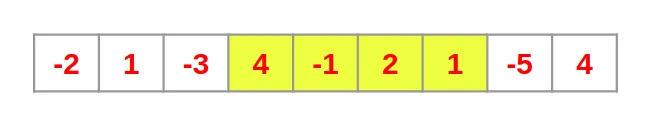
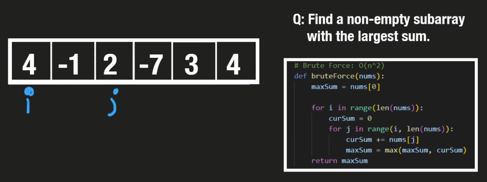
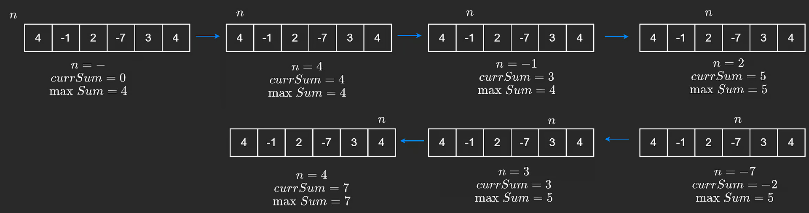
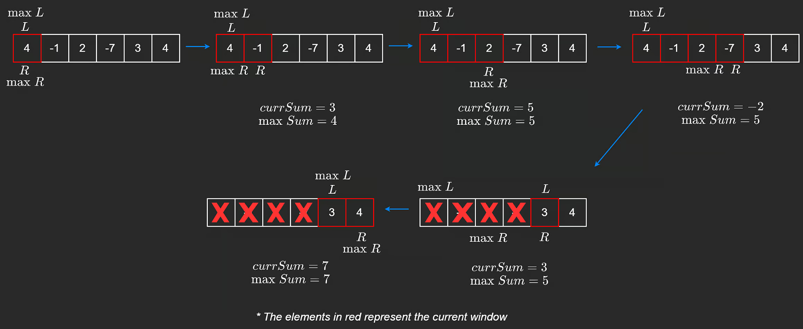

The maximum sum subarray problem, also known as the maximum segment sum problem, is the task of finding a contiguous subarray with the largest sum, within a given one-dimensional array A\[1...n\] of numbers. **It can be solved in *O(n)* time and *O(1)* space.**



Some properties of this problem are:

1.  If the array contains all non-negative numbers, then the problem is trivial; a maximum subarray is the entire array.
2.  If the array contains all non-positive numbers, then a solution is any subarray of size 1 containing the maximal value of the array (or the empty subarray, if it is permitted).
3.  Several different sub-arrays may have the same maximum sum.

A simple single-pass algorithm known as **Kadane's algorithm** solves this problem efficiently.

#### Bruteforce solution

The naive way to solve the problem is using a bruteforce strategy. 

  
We could evaluate each subarray and return the maximum. To do that, two nested loops are required. The first controls the index of the starting element, and the second controls an index moving to the right. When the second loop completes, we move the index of the first to the right. This has a complexity of *O($n^2$)*. Here is a C++ implementation:

```C++
int bruteForce(vector<int>& nums) {
    int maxSum = nums[0];

    for (int i = 0; i < nums.size(); ++i) {
        int curSum = 0;
        for (int j = i; j < nums.size(); ++j) {
            curSum += nums[j];
            maxSum = max(maxSum, curSum);
        }
    }
    return maxSum;
}
```

#### Kadane's algorithm

It is a greedy and dynamic programming algorithm, which has a lot of overlapping with other fundamental algorithms. Kadane's algorithm tells us that there is a way to calculate the largest sum by only making one pass on the array, bringing the complexity down to linear time (*O(n)*).

The key intuition is very simple. We should avoid negative numbers, as they will only make our sum smaller. **Kadane's algorithm runs one for loop over the array and at the beginning of each iteration, if the current sum is negative, it will reset the current sum to zero**. This mean that if we encounter a subarray with a negative sum, we discard it, and we keep considering a subarray as long as it has a positive sum.



Here is a C++ implementation:

```C++
int kadanes(vector<int>& nums) {
    int maxSum = nums[0];
    int curSum = 0;

    for (int n : nums) {
        curSum = max(curSum, 0);
        curSum += n;
        maxSum = max(maxSum, curSum);
    }
    return maxSum;
}
```

This problem has some overlap with the common sliding window pattern (dynamically resized variant). This becomes very clear if we slightly change the problem request to returning the actual subarray containing the largest sum, instead of just the sum itself. We can solve this problem using two pointers, adding elements from the right and removing them from the left. Similar to before, if our current sum becomes negative, we can move our left pointer all the way to our right pointer. This means that our constraint was broken and we remove all elements from the left and start a new window.



Here is a C++ implementation:

```C++
vector<int> slidingWindow(vector<int> nums) {
    int maxSum = nums[0];
    int curSum = 0;
    int maxL = 0, maxR = 0;
    int L = 0;

    for (int R = 0; R < nums.size(); ++R) {
        if (curSum < 0) {
            curSum = 0;
            L = R;
        }
        curSum += nums[R];
        if (curSum > maxSum) {
            maxSum = curSum;
            maxL = L; 
            maxR = R;     
        }    
    }    
    return vector<int>{maxL, maxR};
}
```