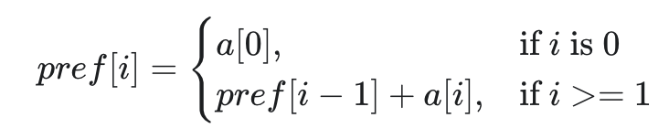

# Introduction

The prefix sum pattern is a technique to efficiently compute cumulative sums or ranges of sums in an array. It pre-processes the array by calculating the sum of all elements in the array up to a certain index. **We can then use these pre-computed sums to quickly calculate the sum of any sub-array in the array**. This technique provides **fast queries on sum of elements in particular subarrays**.

# Implementation

The steps for implementing the prefix sum technique are as follows:

1.  Create a new array of the same length as the original array, and initialize the first element to the value of the first element of the original array.
2.  Starting from the second element, iterate through the rest of the original array, and at each element, calculate the prefix sum by adding the current element to the previous prefix sum, and store this value in the corresponding element of the new array.
3.  **To find the sum of any sub-array, we can use the pre-computed prefix sum array, by subtracting the prefix sum of the ending index of the sub-array from the prefix sum of the starting index - 1**.

While step 1 is quite intuitive, step 2 and 3 are the core of this technique.

For computing the cumulated sum at each position, notice we could use two nested loops. The most internal would basically accumulate all values from index $0$ to the the external loop index. However, that would repeat a lot of work, since it's easy to compute the cumulative sum at index $i$ by reusing the cumulative sum until $i-1$. In some sense, this makes the technique similar to a very basic case of dynamic programming.

The third step is a arguably less intuitive, but it is very easy to retrieve a formula by using a toy example. To calculate the sum of elements from index $l$ to index $r$ ($arr[l] + arr[l+1] + ... + arr[r]$), we can use the following formula:

- For $l > 0$: **$rangeSum(l, r) = prefixSum[r] - prefixSum[l-1]$**
- If $l = 0$: $rangeSum(0, r) = prefixSum[r]$

For example, given $A = [1,2,3,4,5]$, its corresponding prefix sum is $PS = [1, 3, 6, 10, 15]$. We can compute:

- $rangeSum(1, 2) = PS[2] - PS[1-1] = 6 - 1 = 5$
- $rangeSum(0, 2) = PS[2] = 6$

# Use cases

This approach is useful in problems related to subarrays, problems where we are asked to:

- Count the subarrays with some condition
- Find Maximum Length Subarray with some condition
- Check if subarray exists with some given condition

Most of the problems for which prefix sum applies might look like sliding window problems at first. However, sliding windows is typically not applicable to these problems. **Sliding window is only applicable when we are trying to optimize a monotonous function**. **If the input contains $0$s or negative values, the sliding window approach typically fails**.

Notice that this technique is not necessarily tied to the sum operation: **a prefix sum requires only a binary associative operator**. So for example we might substitute sum with product, or any other operator.

# Hash map variant

Sometimes, **the problem might require being able to efficiently query whether we have previously encountered a subarray with a certain sum**. **In this case, we should store our prefix sum as a hash map**, which maps the sum to something, such as the frequency with which it occurs or the end index of the subarray on which it occurs.