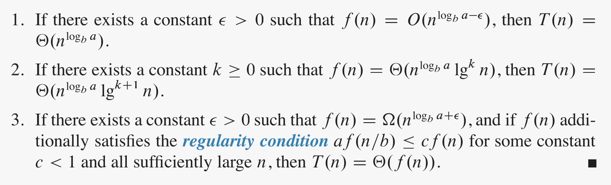

A recurrence relation is an equation according to which the $n$th term of a sequence of numbers is equal to some combination of the previous terms. So, **a recurrence is an equation that describes a function in terms of its value on other, typically smaller, arguments**. Recurrences go hand in hand with the divide-and-conquer method because they give us a natural way to characterize the running times of recursive algorithms mathematically.

A recurrence contains two or more cases, depending on the argument. **If a case involves the recursive invocation of the function on different (usually smaller) inputs, it is a recursive case**. If a case does not involve a recursive invocation, it is a base case. There may be zero, one, or many functions that satisfy the statement of the recurrence. **The recurrence is well defined if there is at least one function that satisfies it**, and ill defined otherwise.

Typically, in algorithm analysis we are dealing with recurrences such that:

1.  For all $n < n_0$, we have $T(n) = Θ(1)$
2.  For all $n ≥ n_0$, every path of recursion terminates in a defined base case within a finite number of recursive invocations.

A recurrence that satisfies these two properties is said to be algorithmic. For algorithmic recurrences, we can safely omit the base case. So, typically, **we denote recurrences by using just the recursive case equation**.

Several methods exist for solving recurrences. The easiest one to apply is the so called master method.

### Master method

The master method is the most immediate way to solve a recurrence. **It only works on recurrences of the form:**

**${\displaystyle T(n)=a\;T\!\left({\frac {n}{b}}\right)+f(n)}$**

We call $f(n)$ a driving function, and we call a recurrence of this form a master recurrence.

A master recurrence describes the running time of a divide-and-conquer algorithm that **divides a problem of size $n$ into $a$ subproblems, each of size $n/b$** . The algorithm solves the $a$ subproblems recursively, each in $T(n/b)$ time. **The driving function $f(n)$ encompasses the cost of dividing the problem before the recursion, as well as the cost of combining the results of the recursive solutions to subproblems**.

The master theorem states that for each master recurrence with $a>0$ and $b>1$:

**The function $n^{log_{b}a}$ is called the watershed function.** In each of the three cases, we compare the driving function $f(n)$ to the watershed function $n^{log_{b}a}$.

- Case 1 applies if the watershed function grows polynomially faster than the driving function.
- Case 2 applies if the two functions grow at a similar rate. More precisely, the driving function grows faster than the watershed function by a factor of $Θ(log^{k}n)$. The most situation for this case is when $k = 0$, meaning the watershed and driving function grow asymptotically at the same rate.
- Case 3 mirrors case 1, meaning the the driving function grows polynomially faster than the watershed function.