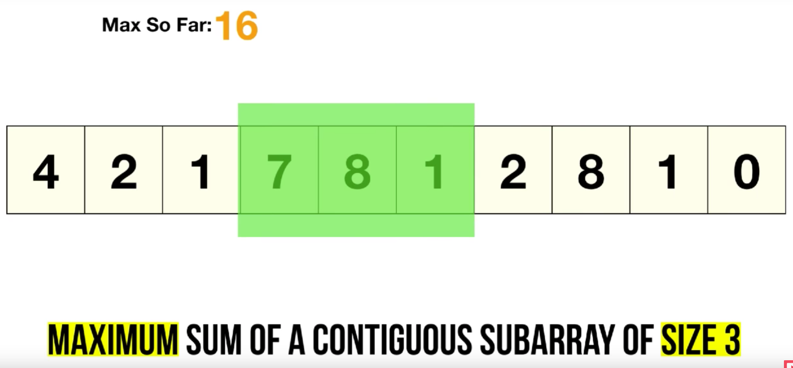

Sliding Window problems are problems in which **a fixed or variable-size window is moved through a data structure** to solve problems efficiently based on continuous subsets of elements. This type of problem strictly **pertains to data structures with contiguous elements**. The idea is to slide a window over the data structure to **find a contiguous subset that verifies a given set of conditions**. Typical examples of conditions we could look for are min, max, longer, shortest, a specific sum, etc. **These type of problems can typically be solved easily by using two nested loops with complexity $O(n^2))$, but can be optimized to $O(n)$ using the sliding window technique**. In fact, this techniques avoids recalculating the solution for overlapping parts.

There are two main types of sliding window problems:

1.  Fixed size window.
2.  Dynamically resizable window.

### Fixed size window

A fixed-size sliding window technique is used when the size of the window (i.e., the length of the subarray or substring) is known beforehand.

The typical template to solve these problems is the following:

1.  Initialize the Window: Start by placing a window at the beginning of the array or string.
2.  Expand the Window: Move the window of the fixed size from left to right, one element at a time.
3.  Compute the Result: At each step, compute the desired result (such as sum, maximum, or average) for the current window.
4.  Update the Result: Before moving to the next position, update the result by removing the contribution of the element that is left behind and adding the contribution of the new element.

A simple example is computing the maximum sum of a contiguous subarray of size $k$.



We keep track of the current sum and increase it until we reach the window size. Now, we compare the current sum with the maximum one we previously had and update it accordingly. To move the window to the next position, we can remove the element $nums[i-k]$ from the current sum and add $nums[i]$. The sliding operation indeed consists in removing the value of the element now outside the window and adding the new one.

```C++
int maxSum(const vector<int>& nums, int k) {
    int curr_sum = 0, max_sum = INT_MIN;
    for (int i = 0; i != nums.size(); ++i) {
        curr_sum += nums[i];
        if (i >= k) curr_sum -= nums[i-k];
        if (i >= k -1) max_sum = max(curr_sum, max_sum);	
    }
    return max_sum;
}
```

### Variable Size Window

The variable-size sliding window technique is used when the size of the window is not fixed and needs to expand or shrink dynamically based on the problem's constraints. Specifically, **the window expands on the right side and restricts on the left side**. You can imagine it moving like a caterpillar. Sometimes, these dynamic variants require the use of an auxiliary data structure. This can arise from the presence of multiple constraints. For example, finding the longest substring with no more than $k$ distinct characters. This problem requires an additional map to count the occurrences of each character.

The typical pattern is the following:

1.  Initialize the Window: Start with two pointers (usually called left and right) representing the current window's boundaries.
2.  Expand the Window: Move the right pointer to expand the window to include more elements until a certain condition is met.
3.  Shrink the Window: **When the window reaches a state that satisfies the condition, move the left pointer to shrink the window to find a more optimal solution**. The left pointer is moved forward until the condition is no longer satisfied.
4.  Repeat: Repeat the expansion and shrinking process until you traverse the entire array or string.

A good example is that of finding he smallest subarray with a sum greater than the given value.

```C++
int minSubArrayLen(int target, const std::vector<int>& nums) {
    int minLength = INT_MAX;
    int currentSum = 0;
    int left = 0;

    for (int right = 0; right < nums.size(); ++right) {
             // Expand the window by moving the right pointer
        currentSum += nums[right];  
        // Shrink the window until the condition is no longer met
        while (currentSum >= target) {
            minLength = std::min(minLength, right - left + 1);
            currentSum -= nums[left];
            left++;
        }
    }
    return (minLength == INT_MAX) ? 0 : minLength;
}
```

Here we fix the left pointer at position 0, and move the right pointer until the condition is met, meaning the sum of the elements in the current subarray is greater than the target. At this point, we try to shrink the window by moving the left pointer forward, to see if we can reach a smaller window that respects our criteria. We move the left pointer until the condition is not met anymore. At this point, we keep moving the right pointer forward and repeat the process.
