A sorting algorithm is an algorithm that puts elements of a list into an order. Efficient sorting is important for optimizing the efficiency of other algorithms (such as search and merge algorithms) that require input data to be in sorted lists.

Formally, the output of any sorting algorithm must satisfy two conditions:

1.  The output is in monotonic order.
2.  The output is a permutation of the input.

**For optimum efficiency, the input data should be stored in a data structure which allows random access rather than one that allows only sequential access**.

Sorting algorithms can be classified on the basis of various parameters:

- Computational complexity. For typical serial sorting algorithms, good behavior is $O(n log n)$, with parallel sort in $O(log n)$, and bad behavior is $O(n^2$). Optimal parallel sorting is $O(log n)$.
- Memory usage. Strictly, an in-place sort needs only O(1) memory beyond the items being sorted.
- Recursive. Some algorithms are strictly recursive or not recursive, while others can be both (e.g. mergesort).
- Stability. Stable sorting algorithms maintain the relative order of records with equal values.
- Comparison based or not.
- Serial or parallel.

### Insertion sort

|     | Worst case | Average case | Best case | Memory |
| --- | --- | --- | --- | --- |
| Complexity | $O(n^2)$ | $O(n^2)$ | $O(n)$ | $O(1)$ |

Insertion sort is a popular algorithm to use for small data sets, while for larger data sets an asymptotically efficient sort is preferable. It has several advantages. It is very simple to implement, it is stable, and in practice it is often more efficient than the other quadratic sorting algorithms.

At each iteration, insertion sort removes one element from the input data, finds the location it belongs within the sorted list, and inserts it there. It repeats until no input elements remain. At each array-position, it checks the value there against the largest value in the sorted list (which happens to be next to it, in the previous array-position checked). If larger, it leaves the element in place and moves to the next. If smaller, it finds the correct position within the sorted list, shifts all the larger values up to make a space, and inserts into that correct position.


At each iteration this:  
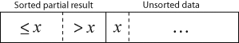  
becomes this:  
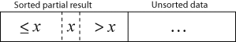

Here is a basic C++ implementation for it:

```C++
template <typename T>
void insertionSort(T& container) {
    for (int i = 1; i < container.size(); ++i) {
        // We go backwards looking for the insert position
        for (int j = i; j && container[j-1] > container[j]; --j) {
            swap(container[j-1], container[j]);
        }
    }
}
```

A more modern and optimize C++ solution uses binary search to find the position where to insert each element, and then calls `std::rotate` to perform the shifting:

```C++
template<typename Iter>
void insertion_sort(Iter first, Iter last)
{
    for (Iter it = first; it != last; ++it)
        std::rotate(std::upper_bound(first, it, *it), it, std::next(it));
}
```

Insertion sort uses a loop invariant as a proof for correctness. The loop invariant is that for each index i, the array A\[0,i-1\], is sorted. Intuitively, because this condition remains true upon loop termination, we can conclude the algorithm is correct and the whole array is sorted.

The best case input is an array that is already sorted. In this case insertion sort has a linear running time (i.e., $O(n)$). During each iteration, the first remaining element of the input is only compared with the right-most element of the sorted subsection of the array.

The simplest worst case input is an array sorted in reverse order. In this case every iteration of the inner loop will scan and shift the entire sorted subsection of the array before inserting the next element. This gives insertion sort a quadratic running time (i.e., $O(n^2)$).

**The average case is also quadratic, which makes insertion sort impractical for sorting large arrays**. **However, insertion sort is one of the fastest algorithms for sorting very small arrays**, even faster than quicksort; indeed, good quicksort implementations use insertion sort for arrays smaller than a certain threshold (which is generally around 10 elements).

### Selection sort

|     | Worst case | Average case | Best case | Memory |
| --- | --- | --- | --- | --- |
| Complexity | $O(n^2)$ | $O(n^2)$ | $O(n^2)$ | $O(1)$ |

Selection sort is an in-place sorting algorithm with quadratic complexity. This makes it inefficient on large data structures. For small data structures, insertion sort is typically preferred, as it displays better performance.

The algorithms is very simple. The basic idea is to find the lowest value in the sequence and moving it to its front. More formally, the algorithm divides the input list into two parts: a sorted sublist of items which is built up from left to right at the front (left) of the list and a sublist of the remaining unsorted items that occupy the rest of the list. Initially, the sorted sublist is empty and the unsorted sublist is the entire input list. The algorithm proceeds by finding the smallest element in the unsorted sublist.  
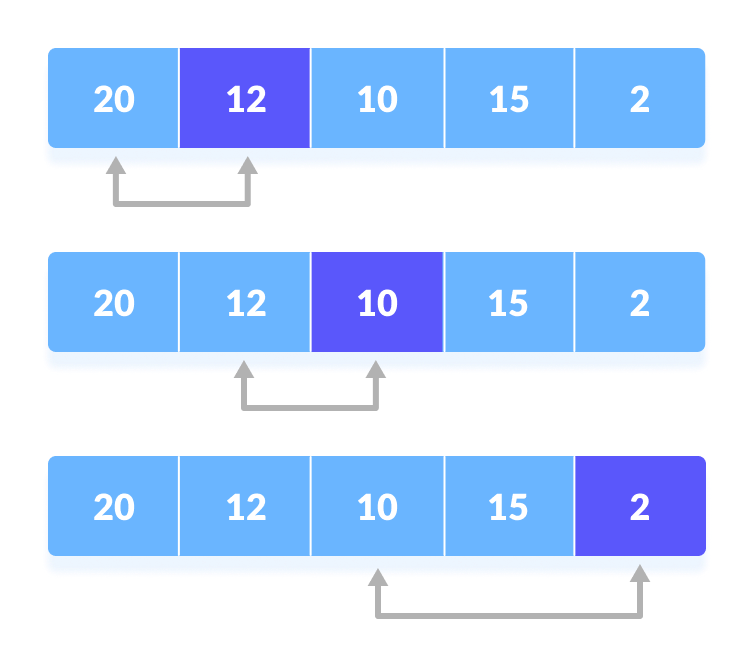

Then, the minimum value is swapped with the leftmost unsorted element (putting it in sorted order), and moving the sublist boundaries one element to the right.  
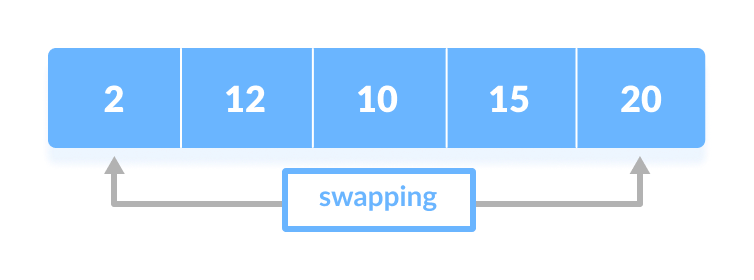

This procedure is repeated until the sequence is sorted.

Notice that **the procedure is independent from the data contained in the sequence**, meaning that, give two sequences of the same size, the number of comparisons to perform is the same. Therefore, the complexity is $Θ(n^2)$. This explains why the algorithm is less efficient than insertion sort, especially when the input sequence is already mostly sorted. Nevertheless, selections sort appears to perform better than other $Θ(n^2)$ like bubble sort.

Here is a possible C++ implementation:

```C++
template <typename T>
void selectionSort(T& container) {
    for (int i = 0; i < container.size(); ++i) {
        int minidx = i;
        for (int j = i+1; j < container.size(); ++j) {
            if (container[j] < container[minidx]) minidx = j;
        }
        swap(container[i], container[minidx]);
    }
}
```

### Bubble sort

|     | Worst case | Average case | Best case | Memory |
| --- | --- | --- | --- | --- |
| Complexity | $O(n^2)$ | $O(n^2)$ | $O(n)$ | $O(1)$ |

Bubble sort is on of the simplest sorting algorithms. It repeatedly steps through the input list element by element, comparing the current element with the one after it, swapping their values if needed. These passes through the list are repeated until no swaps have to be performed during a pass, meaning that the list has become fully sorted. The algorithm, which is a comparison sort, is named for the way the larger elements "bubble" up to the top of the list.


The basic procedure of bubble sort is the following:

1.  Go through the array, one value at a time.
2.  For each value, compare the value with the next value.
3.  If the value is higher than the next one, swap the values so that the highest value comes last.
4.  Go through the array as many times as size of the array minus 1.

This is an example of one iteration:  
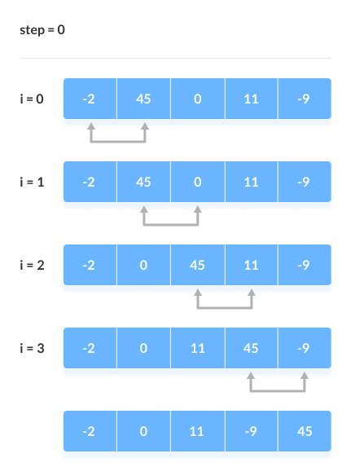

We can perform some slight optimizations to this basic idea.  
First, we observe that after each iteration, the largest element among the unsorted elements is placed at the end. In general, the n-th pass finds the n-th largest element and puts it into its final place. This means that we can loop on one less item at each iteration, since the portion of the list to be sorted is progressivbely reduced.  
Second, it is not always necessary to loop through the array n-1 times. Sometimes it is possible the array ends up being sorted in fewer iterations. We can keep track of this using a boolean: if no swap is performed during an array scan, we can break from the procedure.

Here is a C++ implementation:

```C++
void bubbleSort(int arr[], int n)
{
    for (int i = 0; i < n - 1; i++) {
        bool swapped = false;
        for (int j = 0; j < n - i - 1; j++) {
            if (arr[j] > arr[j + 1]) {
                swap(arr[j], arr[j + 1]);
                swapped = true;
            }
        }
        if (swapped == false) break;
    }
}
```

Bubble sort has a worst-case and average complexity of ${\displaystyle O(n^{2})}$. Even other ${\displaystyle O(n^{2})}$ sorting algorithms, such as insertion sort, generally run faster than bubble sort, and are no more complex. For this reason, bubble sort is rarely used in practice. Due to its simplicity, bubble sort is often used to introduce the concept of an algorithm, or a sorting algorithm, to introductory computer science students.

Bubble sort is asymptotically equivalent in running time to insertion sort in the worst case, but the two algorithms differ greatly in the number of swaps necessary. Bubble sort also interacts poorly with modern CPU hardware. It produces at least twice as many writes as insertion sort, twice as many cache misses, and asymptotically more branch mispredictions.

Donald Knuth, in The Art of Computer Programming, concluded that "the bubble sort seems to have nothing to recommend it, except a catchy name and the fact that it leads to some interesting theoretical problems".

Among the few positivbes, bubble sort is adaptive, which can give it an advantage over algorithms like selection sort. This means that it may outperform those algorithms in cases where the list is already mostly sorted, since bubble sort is ${\displaystyle O(n)}$ on a list that is already sorted. It also parallelizes better than insertion sort and selection sort, when parallel processing is allowed.

### Mergesort

|     | Worst case | Average case | Best case | Memory |
| --- | --- | --- | --- | --- |
| Complexity | $O(nlogn)$ | $O(nlogn)$ | $O(nlogn)$ | $O(n)$ |

Merge sort is a divide-and-conquer algorithm that is stable in most implementations.

We can divide the algorithm in the following steps:

1.  Divide: Divide the list or array recursively into two halves until it can no more be divided.
2.  Conquer: Each subarray is sorted individually using the merge sort algorithm.
3.  Merge: The sorted subarrays are merged back together in sorted order. The process continues until all elements from both subarrays have been merged.

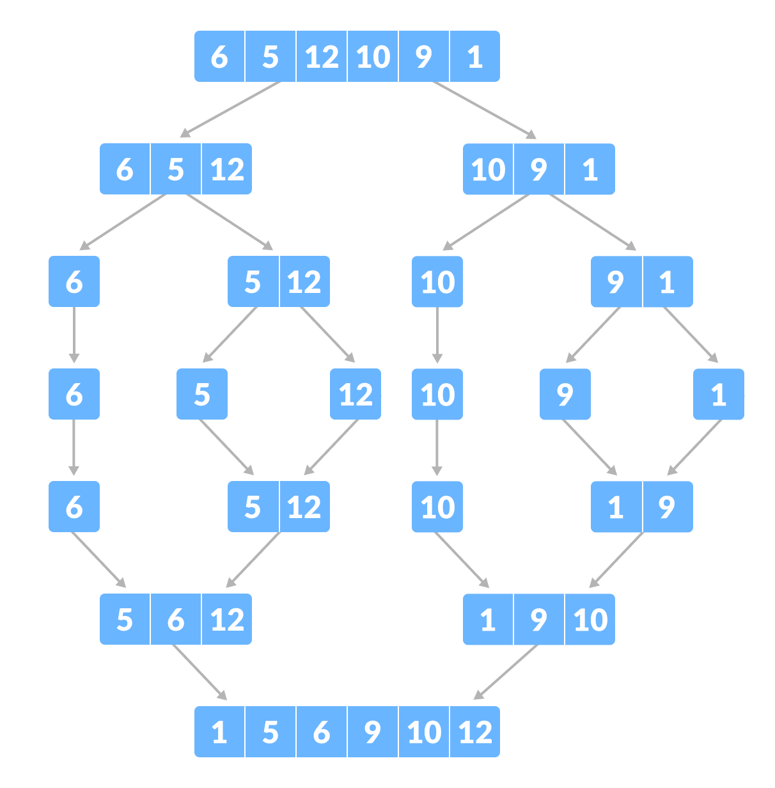

Merge sort is a stable sorting algorithm. One downside is that it does not sort in place: in fact, the merge step requires using an auxiliary array to store the result of the merge, which results in $O(n)$ space. This requirement can hinder cache locality for large arrays, especially when compared to other algorithm which use less additional space, such as quicksort. It is however one the best algorithms when used on sequential data structures with slow access to elements. It is also popular for sorting linked lists, as in that case it is possible to create a variant of the algorithm that uses $O(1)$ space.

### Heap sort

|     | Worst case | Average case | Best case | Memory |
| --- | --- | --- | --- | --- |
| Complexity | $O(nlogn)$ | $O(nlogn)$ | $O(nlogn)$ | $O(1)$ |

Heap sort is an algorithm that holds a similarity with selection sort, except it uses an efficient data structure. Like selection sort, heapsort divides its input into a sorted and an unsorted region, and it iteratively shrinks the unsorted region by extracting the largest element from it and inserting it into the sorted region. Unlike selection sort, heapsort does not waste time with a linear-time scan of the unsorted region; rather, heap sort maintains the unsorted region in a heap data structure to efficiently find the largest element in each step.

The algorithms is divided in two phases:

1.  Heap construction
2.  Heap extraction

The algorithm starts by calling `build-heap` to build a max heap. The heap is converted to a sorted array by repeatedly removing the largest element from the heap (the root of the heap), and placing it at the end of the array. This element is then declared to be part of the sorted suffix. The size of heap is decreased by one, and the `heapify-down` procedure is called on the new root to restore the heap property. This procedure is repeated until the heap contains only a single element.

The `build-heap` operation is run once, and is $O(n)$ in performance. The `heapify-down` function is called $n$ times and requires $O(log n)$ work each time. Therefore, the performance of this algorithm is $O(n + n log n) = O(n log n)$.

Heapsort's primary disadvantages are its poor locality of reference and its inherently serial nature; the accesses to the implicit tree are widely scattered and mostly random, and there is no straightforward way to convert it to a parallel algorithm. A well-implemented quicksort is usually 2–3 times faster than heapsort. The main advantage of quicksort is its much better locality of reference. The worst-case performance guarantees make heapsort popular in real-time computing.

### Quicksort

Quicksort is a divide-and-conquer sorting algorithm. Unlike merge sort, it sorts the input array in place, but its worst case complexity is higher.

It works by selecting a 'pivot' element from the array and partitioning the other elements into two sub-arrays, according to whether they are less than or greater than the pivot. The sub-arrays are then sorted recursively.

The three steps are the following:

1.  **Divide**. The input array is divided into subarrays by selecting a pivot element. While dividing the array, the pivot element should be positioned in such a way that elements less than pivot are kept on the left side and elements greater than pivot are on the right side of the pivot.
2.  **Conquer**. We recursively call the quicksort procedure on each sub-array.
3.  **Combine**. No work is required to combine the sub-arrays since they are already sorted.

**The key step in quicksort is the partition procedure**. This rearranges the input array in place, returning the index of the dividing point between the two sides of the partition. Simpler implementations, always use the last element of the array as the pivot.


To rearrange the items, we keep a pointer on the pivot, one on the current element, and one starting at the first element, which we can call $j$. $j$ is an index that represents the final position that the pivot will take.

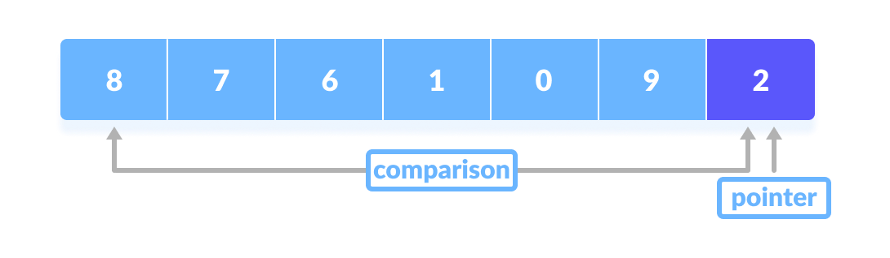

We scan the array and for each element that is $<=$ than the pivot, we swap it with the element pointed by $j$, and then increase the index.

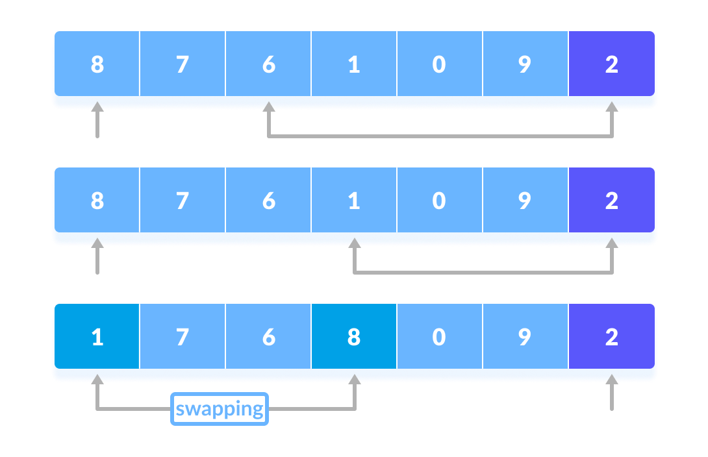

Notice that it is possible for an element to be swapped with itself. For example, if the first element in the array is less than the pivot, $j$ will point to the element itself. This procedure goes until we inpsect the last element before the pivot.

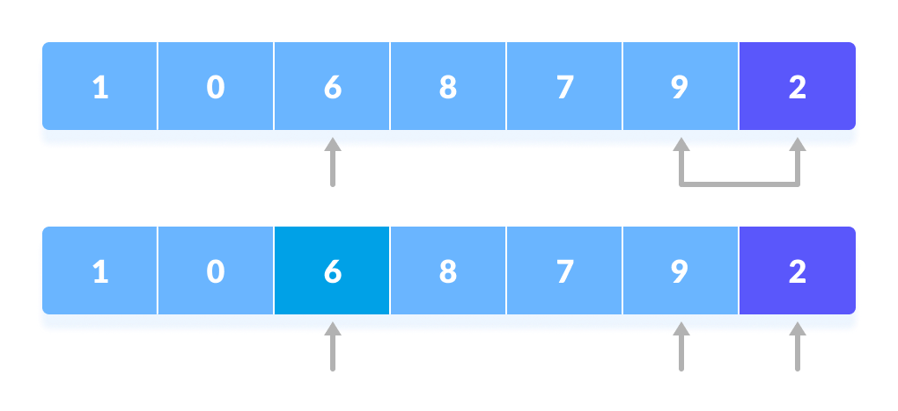

At this point, $j$ points exactly to where the pivot should be, meaning it points to the place that partitions the low side from the high side. So, we can simply swap the pivot with the element pointed to by $j$, so that the pivot will lie between the two partitions.

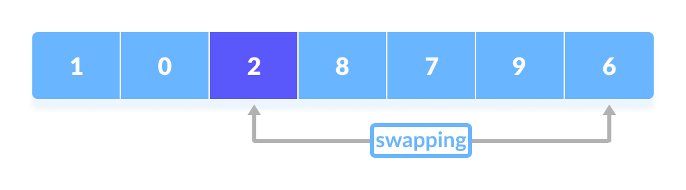

Finally, we can return the new pivot index.

It is interesting to notice that the partition procedure marks 4 regions with the array.

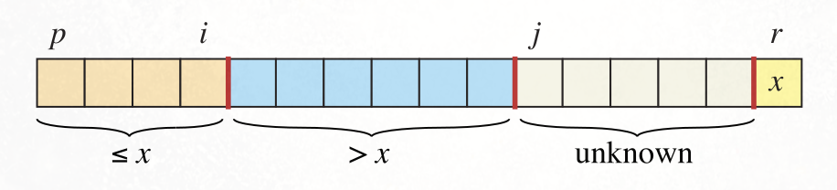

From left to right, we have the values that are $<=$ than the pivot, then the values greater, then the ones still to inspect, and finally the pivot itself.

The running time for the partition procedure is $Θ(n)$.

**The running time of quicksort depends on how balanced each partitioning is, which in turn depends on which elements are used as pivots**. If the two sides of a partition are about the same size (the partitioning is balanced) then the algorithm runs asymptotically as fast as merge sort. If the partitioning is unbalanced, however, it can run asymptotically as slowly as insertion sort. Also notice that athough quicksort sorts in place according to the common definition, the amount of memory it uses is not constant. Since each recursive call requires a constant amount of space on the runtime stack, outside of the array being sorted, quicksort requires space proportional to the maximum depth of the recursion, which can be as much as $O(n)$ in the worst case.

The **worst case** occurs when the partitioning produces one sub-problem with size $n-1$ and one with size $0$ for each recursive call. This **occurs when the input array is sorted** (either in ascending or descending order). In this case, the depth of recusion becomes  $O(n)$ and the algorithm complexity becomes $Θ(n^2)$. At the opposite, the best case is that in which each split partitions the array in two parts of equal size, in which case the complexity becomes $Θ(n logn)$.

Because a sorted input array is a relatively common case, it is possible to design a randomized version of quicksort to obtain good performance over a larger range of inputs. The idea is also extremely simple: instead of always using the same element as pivot, we can choose a random element and swap it with the last one in the array. We then call the parition procedure discussed before, which works exactly as before. So in practice, we can simply wrap the call to partiition in an outer function which randomly selects a pivot and puts it in the expected position.

