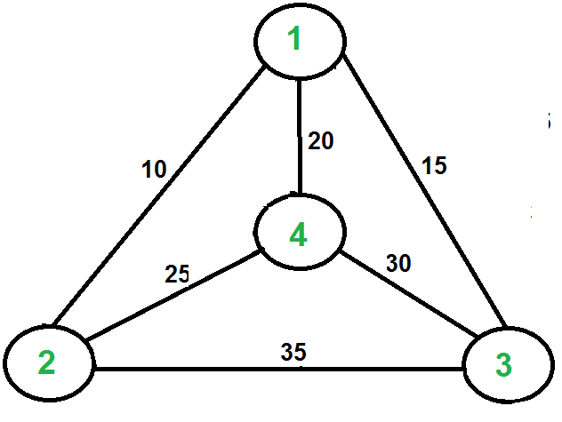

Problem formulation:

*Given a list of cities and the distances between each pair of cities, what is the shortest possible route that visits each city exactly once and returns to the origin city?*

In other terms,  given a weighted complete graph, the task to perform is finding a cheapest tour which visits every vertex. In fact, the problem can be modeled as an undirected weighted graph, such that cities are the graph's vertices, paths are the graph's edges, and a path's distance is the edge's weight. It is a minimization problem starting and finishing at a specified vertex after having visited each other vertex exactly once.

For example, consider the graph shown in the figure, a possible tour is 1-2-4-3-1., with a total cost of 10+25+30+15, which is 80. 

This is a calssical algorithmic problem in the field of computer science, which is often referred to as TSP.  It is a **NP-hard** problem, for which there is no polynomial-time know solution.

The traditional lines of attack for the NP-hard problems are the following:
- Devising exact algorithms, which work reasonably fast only for small problem sizes.
- Devising "suboptimal" or heuristic algorithms, i.e., algorithms that deliver approximated solutions in a reasonable time.

### Exact algorithms

The most direct solution would be to try all permutations (ordered combinations) and see which one is cheapest (using **brute-force search**). The running time for this approach lies within a polynomial factor of **${\displaystyle O(n!)}$**, the factorial of the number of cities. This solution becomes unfeasible very quickly. For example, for 6 cities we would need to check 720 routes, and the number increases to 40,320 routes for 8 cities. With 15 destinations, the number of possible routes could exceed 87 billion.

The only other exact algorithm known with better performances is the **Held–Karp algorithm**. It is a dynamic programming algorithm which solves the problem in time **${\displaystyle O(n^{2}2^{n})}$**.

