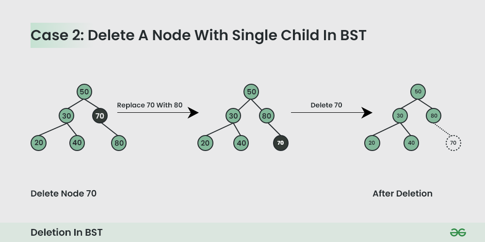

# Trees

A tree is a hierarchical structure with a set of connected nodes. Each node in the tree can be connected to many children but must be connected to exactly one parent, except for the root node, which has no parent. This means that **each child can be treated like the root node of its own subtree, making recursion a useful technique for tree traversal**.

A node is a structure which may contain data and connections to other nodes, sometimes called edges or links. Each node in a tree has zero or more child nodes, which are below it in the tree. A node that has a child is called the child's parent node. All nodes have exactly one parent, except the topmost root node, which has none. A node might have many ancestor nodes, such as the parent's parent. Child nodes with the same parent are sibling nodes. The height of a node is the length of the longest downward path to a leaf from that node. The height of the root is the height of the tree. The depth of a node is the length of the path to its root.

The typical way to represent trees is to have nodes as dynamically allocated records with pointers to their children, their parents, or both, as well as any associated data. In particular cases, other representations are possible. For example, nodes may be store in an array, which is the case for binary heaps.

# Binary trees

A binary tree is a tree data structure in which each node has at most two children, referred to as the left child and the right child.

Types of binary trees:

- A full binary tree is a tree in which every node has either 0 or 2 children.
- A perfect binary tree is a binary tree in which all interior nodes have two children and all leaves have the same depth or same level.
- A complete binary tree is a binary tree in which every level, except possibly the last, is completely filled, and all nodes in the last level are as far left as possible.
- A balanced binary tree is a binary tree structure in which the left and right subtrees of every node differ in height by no more than 1.
- A degenerate (or pathological) tree is where each parent node has only one associated child node. This means that the tree will behave like a linked list data structure.

## Traversal

**Tree traversal refers to the process of visiting (e.g. retrieving, updating, or deleting) each node in a tree data structure, exactly once**. **Such traversals are classified by the order in which the nodes are visited**.

In fact, unlike linear data structures, which are canonically traversed in linear order, trees may be traversed in multiple ways. **The broadest distinction is between depth-first or breadth-first order**.

**Traversing a tree involves iterating over all nodes in some manner. Because from a given node there is more than one possible next node (it is not a linear data structure), then, some nodes must be deferred—stored in some way for later visiting**. This is often done via a stack (LIFO) or queue (FIFO). **As a tree is a self-referential (recursively defined) data structure, traversal can be defined by recursion in a natural and clear fashion; in these cases the deferred nodes are stored implicitly in the call stack**.

Depth-first search is easily implemented via a stack, including recursively (via the call stack), while breadth-first search is easily implemented via a queue, including corecursively.

### Depth-first search (DFS)

**In depth-first search (DFS), the search tree is deepened as much as possible before going to the next sibling**. To traverse binary trees with depth-first search, perform the following operations at each node:

1.  If the current node is empty then return.
2.  Execute the following three operations in a certain order:
    - N: Visit the current node.
    - L: Recursively traverse the current node's left subtree.
    - R: Recursively traverse the current node's right subtree.

**According to the order in which these operations are performed, we can distiguish three different DFS methods: in-order, pre-order and post-order**.

The traversal trace is a list of each visited node. Given the same three, each traversal method, in general, produces a different trace.

Notice that, by convention, given the root of a tree, we always visit the left subtree before the right subtree. For each traversal method, we can always devise a reversed version, where the right subtree is explored before the left one.

The time complexity for all these procedures is $Θ(n)$, since we must visit each node exactly once. However, the memory complexity changes between BFS and DFS.

#### Pre-order DFS

Preorder traversal visits the node in the order: Root -> Left -> Right . This translates into the sequence of operations NLR.


Here is a simple C++ program to print each node with pre-order traversal:

```C++
template <typename T>
void preorderTreePrint(const TreeNode<T>* root) {
    if (root) {
        std::cout << root->val << " ";
        inorderTreePrint(root->left);
        inorderTreePrint(root->right);
    }
}
```

#### In-order DFS

In-order traversal visits the node in the order: Left -> Root -> Right. This translates into the sequence of operations LNR.


Here is a simple C++ program to print each node with in-order traversal:

```C++
template <typename T>
void inorderTreePrint(TreeNode<T>* root) {
    if (root) {
        inorderTreePrint(root->left);
        std::cout << root->val << " ";
        inorderTreePrint(root->right);
    }
}
```

#### Post-order DFS

In-order traversal visits the node in the order: Left -> Right -> Root. This translates into the sequence of operations LRN.


Here is a simple C++ program to print each node with post-order traversal:

```C++
template <typename T>
void postorderTreePrint(TreeNode<T>* root) {
    if (root) {
        inorderTreePrint(root->left);
        inorderTreePrint(root->right);
        std::cout << root->val << " ";
    }
}
```

## Operations

Here are some interesting operations that could be performed on a tree.

### Lowest Common Ancestor (LCA)

The lowest common ancestor (LCA) of two nodes $v$ and $w$ in a tree $T$ is the lowest (i.e. deepest) node that has both $v$ and $w$ as descendants, where we define each node to be a descendant of itself (so if $v$ has a direct connection from $w$, $w$ is the lowest common ancestor).

### Breadth-first search (BFS)

**In breadth-first search (BFS), the search tree is broadened as much as possible before going to the next depth**. It starts at the tree root and explores all nodes at the present depth prior to moving on to the nodes at the next depth level. For this reason, it is also known as Level Order Traversal.


Unlike DFS, BFS uses a queue instead of a stack. This is because, when visiting a node, we need to keep track of its children to visit them later. Since BFS requires a queue, we cannot leverage the function call stack as we did for DFS. This means that this algorithms is typically implemented iteratively by manually managing the queue.

Here is a simple C++ program to print each node with BFS traversal:

```C++
template <typename T>
void bfsTreePrint(TreeNode<T>* root) {
    if (!root) return;
    std::queue<TreeNode<T>*> child_queue;
      child_queue.push(root);
    while (!child_queue.empty()) {
        TreeNode<T>* node = child_queue.front();
        std::cout << node->val << " ";
        child_queue.pop();
        if (node->left) child_queue.push(node->left);
        if (node->right) child_queue.push(node->right);
    }    
}
```

At one time, the queue will contain all the nodes on one level of the tree. If the tree is perfect, the queue reachest its largest capacity when inpsecting the leaf level, holding $n/2$ elements. This means the memory complexity of this procedure is $O(n)$. The best space complexity is instead achieved in a pathological tree, where the queue only stores one element for each level. Notice this is the exact opposite of DFS. In DFS, when the tree is degenerate, the depth of recursion becomes equal to $n$, which is the worst case. For a complete tree instead, the depth of recursion become $log n$, which is the ideal case.

# Binary search trees

A binary search tree (BST) is a particular type of rooted binary tree. In particular, the keys of a BST are stored in such a way as to satsify the binary search tree property:

1.  All nodes of the left subtree are less than the root node
2.  All nodes of the right subtree are more than the root node
3.  Both subtrees of each node are also BSTs i.e. they have the above two properties


This means BSTs are arranged in a strict total order. **Often, there is an implicit requirement that a BST must not contain duplicate values**. This assumption does not cause a big loss in terms of generality. In fact, it is conceptually trivial to implement duplicates as a list at node level. Alternatively, one could tweak the definition of BST property to use $≤$ or $≥$, but this would require adding additional computational steps to several algorithms.

The easiest way to represent a BST is by using a linked data structure.

## Operations

Most of the operations on BSTs (such as search, max, insertion, deletion) have a complexity that is proportional to the height of the tree ($O(h)$). If the tree is balanced, the height of the tree is $log n$. However, if the tree is degenerate, the height of tree becomes equal to $n$. Because of this, several other tree schemes exist that aim to keep the tree balanced at each operation, in order to guarantee $O(log n)$ time as worst case.

### Traversal

**Because of the BST property, it is possible to print each node in the tree in ascending order using a simple in-order traversal**. The fact that an in-order traversal accesses each node in sorted ascending order is one of the fundamental properties of a BST.

### Search

Searching for a node can be implemented recursively or iteratively. In fact, due to the BST property, we can discard half of the tree at each node encountered, meaning that at each node the procedure follows either the left or right subtree, but not both.


The nodes traversed during the search form a simple path downward from the root of the tree.

```C++
template <typename T>
const TreeNode<T>* findBSTIter(const TreeNode<T>* root, const T& val) {
    while (root && root->val != val)
        root = (val < root->val) ? root->left : root->right;
    return root;
}
```

### Minimum and maximum

To find the minimum, just follow the left child pointers until you get to the leftmost node. In the same way, the maximum is the rightmost node in the tree.

### Insertion

New nodes are always inserted as leaves in the tree. The idea is to perform a search until we reach a leaf node. Then, depending on the value of the leaf node, we will insert the new node as its left or right child. This procedure can be performed iteratively.

```C++
template <typename T>
TreeNode<T>* insertBSTIter(TreeNode<T>* root, const T& val) {
    TreeNode<T>* prev = nullptr;
    TreeNode<T>* curr = root;
    while (curr) {
        prev = curr;
        curr = (val < curr->val) ? curr->left : curr->right;
    }
    if (!prev) return new TreeNode<T>(val);
    if (val < prev->val) prev->left = new TreeNode<T>(val);
    else prev->right = new TreeNode<T>(val);
    return root;
}
```

### Deletion

This operation is more complex than insertion, and can be broken down into 3 scenarios, in increasing order of difficulty:
1. Delete a leaf node. This is the easiest case, and can be enforced trivially.


2. Delete a Node with Single Child. In this case, we need to elevate the child of the node to delete. This means that we need to connect the parent of the node to delete with the only child of the target.



3. Delete a Node with Both Children. This is the most complex case. First, we must find the successor of the node to delete. This is the minimum node in the target's right subtree. Then, we assign to the target the value of the successor. Finally, we remove the successor from the tree.

